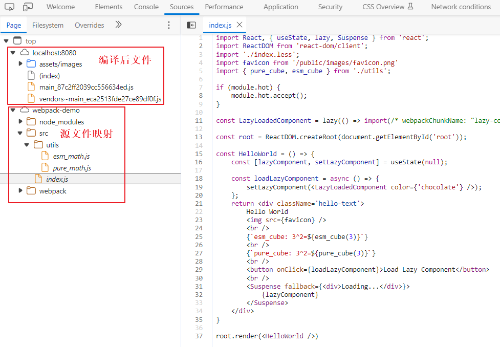
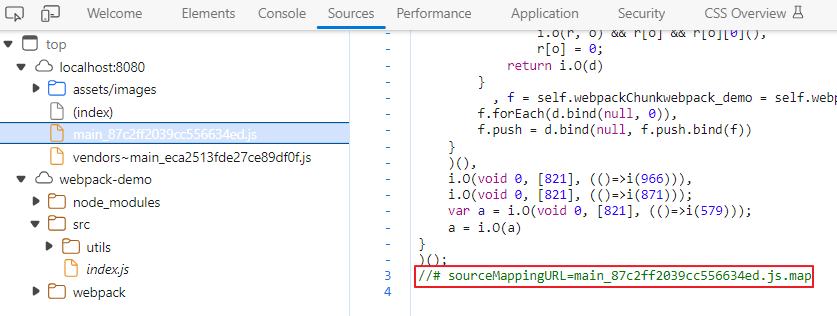
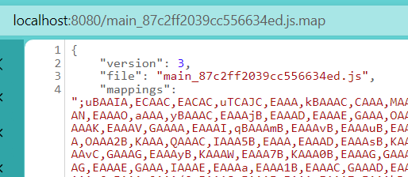

> 本文代码案例主要通过对Webpack配置的修改来实现不同的进阶功能。同时，在各小节的修改案例中会附上部分关键配置字段的解释。

# 代码分割

代码分离是 webpack 中最引人注目的特性之一。此特性能够把代码分离到不同的 bundle 中，然后可以按需加载或并行加载这些文件。

代码分离可以用于获取更小的 bundle、控制资源加载优先级，如果使用合理，会极大减小加载时间。

常用的代码分离方法有三种：

* **多入口打包**：使用 `entry`​ 配置手动地分离代码。
* **公共模块提取**：使用 [入口依赖](https://webpack.docschina.org/configuration/entry-context/#dependencies) 或者 `SplitChunksPlugin`​ 去重和分离 chunk。
* **动态导入**：通过模块的内联函数调用分离代码。

## 多入口打包

这是迄今为止最简单直观的代码分离方式，一般用于多页面应用，即：一个页面对应一个打包入口

* 案例地址：[https://github.com/zephyr-133/webpack-demo/tree/master/16-code_splitting_multi_entry](https://github.com/zephyr-133/webpack-demo/tree/master/16-code_splitting_multi_entry)
* 开发过程：

  * 新增second页面

    ```diff
    webpack-demo
    |- package.json
    |- webpack.config.js
    |- /dist
    |- /src
      |- index.js
      |- index.less
      |- template.html
    + |- second.js
    + |- second.less
    ```
  * 更新webpack入口及HtmlWebpackPlugin设置：

    > 多入口打包需要给HtmlWebpackPlugin设置chunks属性，指定入口对应的引用资源文件，否则会引用所有打包资源。
    >

    ```javascript
    const HtmlWebpackPlugin = require('html-webpack-plugin');
    module.exports = {
        entry: {
            main: './src/index.js',
            second: './src/second.js',
        },
        plugins: [
            new HtmlWebpackPlugin({
                template: './src/template.html',
                filename: 'index.html',
                chunks: ['main'],
            }),
            new HtmlWebpackPlugin({
                template: './src/template.html',
                filename: 'second.html',
                chunks: ['second'],
            }),
        ],
    };示例：
    ```
* 缺陷：

  * 如果入口chunk之间包含一些重复的公共模块，那么这些重复模块都会被引入到各个bundle中。
  * 这种方法不够灵活，并且不能动态地拆分应用程序逻辑中的核心代码。

## 公共模块提取

### 入口依赖

在webpack入口中配置dependOn选项，在多个chuank之间共享模块

* 案例地址：[https://github.com/zephyr-133/webpack-demo/tree/master/17-code_splitting_dependOn](https://github.com/zephyr-133/webpack-demo/tree/master/17-code_splitting_dependOn)
* 开发过程：

  * 在webpack中将公共模块‘lodash’提取到依赖中，并更新HtmlWebpackPlugin插件生成页面的依赖chunks：

    ```javascript
    const HtmlWebpackPlugin = require('html-webpack-plugin');

    module.exports = {
        entry: {
            main: {
                import: './src/index.js',
                dependOn: 'shared',
            },
            second: {
                import: './src/second.js',
                dependOn: 'shared',
            },
            shared: 'lodash',
        },
        plugins: [
            new HtmlWebpackPlugin({
                template: './src/template.html',
                filename: 'index.html',
                chunks: ['main', 'shared', 'runtime'],
            }),
            new HtmlWebpackPlugin({
                template: './src/template.html',
                filename: 'second.html',
                chunks: ['second', 'shared', 'runtime'],
            }),
        ],
        optimization: {
            runtimeChunk: 'single',
        },
    };
    ```

    > 对于每个 runtime chunk，导入的模块会被分别初始化，因此如果你在同一个页面中引用多个入口起点，请注意此行为。你或许应该将其设置为 `single`​，或者使用其他只有一个 runtime 实例的配置。
    >

    > runtime(伴随manifest数据)：在浏览器运行过程中，webpack用来连接模块化应用程序所需的所有代码。它包含：在模块交互时，连接模块所需的加载和解析逻辑。如，已经加载到浏览器中的连接模块逻辑，以及尚未加载模块的延迟加载逻辑。
    >

    > manifest：当项目应用在浏览器以Index.html文件的形式被打开，一些bundle和应用需要的各种资源都需要用某种方式被加载和链接起来。原先项目的目录文件结构在经过webapck的打包，压缩，代码拆分优化之后都不复存在，这时webpack就是通过manifest数据来管理所有所需模块之间的交互。当compiler开始执行，解析和映射应用程序时，manifest保留了所有模块的详细要点，当完成打包并发送到浏览器时，runtime会通过manifest来解析和加载模块。无论你选择哪种模块语法，那些‘import’或‘require’都己经转换成__webpack_require__方法，此方法指向模块标识符，通过使用manifest中的数据，runtime将能够检索这些标识符，找出每个标识符背后对应的模块。
    >
    > 当我们在代码分割中，想要查看打包文件清单，我们可以在webpack5中借助webpack-manifest-plugin输出manifest.json文件进行查看。
    >
    > ```shell
    > npm i webpack-manifest-plugin -D
    > ```
    >
    > ```javascript
    > const { WebpackManifestPlugin } = require('webpack-manifest-plugin');
    > const options = {};
    >
    > module.exports = {
    >   plugins: [
    >     new WebpackManifestPlugin(options)
    >   ]
    > };
    > ```
    >

### SplitChunksPlugin

SplitChunksPlugin插件可以将公共的依赖模块提取到已有的入口chunk中，或者提到一个新生成的chunk。这个插件从webpack V4开始被内置，使用optimization.splitChunks进行配置，取代了之前的CommonsChunkPlugin。

> 默认情况下，它只会影响到按需加载的 chunks，因为修改 initial chunks 会影响到项目的 HTML 文件中的脚本标签。
>
> webpack 将根据以下条件自动拆分 chunks：
>
> * 新的 chunk 可以被共享，或者模块来自于 `node_modules`​ 文件夹
> * 新的 chunk 体积大于 20kb（在进行 min+gz 之前的体积）
> * 当按需加载 chunks 时，并行请求的最大数量小于或等于 30
> * 当加载初始化页面时，并发请求的最大数量小于或等于 30
>
> 在尝试满足最后两个条件时，更大的代码块被优先考虑。

* 案例地址：[https://github.com/zephyr-133/webpack-demo/tree/master/18-code_splitting_split_chunks_plugin](https://github.com/zephyr-133/webpack-demo/tree/master/18-code_splitting_split_chunks_plugin)
* 开发过程：

  * 使用optimization.splitChunks做默认代码分割配置

    > optimization.splitChunks配置会自动跟HtmlWebpackPlugin结合使用，自动注入生成的chunks。
    >

    ```javascript
    module.exports = {
        entry: {
            main: './src/index.js',
            second: './src/second.js',
        },

        optimization: {
            splitChunks: {
                chunks: 'all',
            }
        },
    };
    ```

    > 配置字段解释：
    >
    > ```javascript
    > module.exports = {
    >   optimization: {
    >     splitChunks: {
    >       chunks: 'all',
    >       minSize: 20000,
    >       maxSize: 60000,
    >       minRemainingSize: 20000,
    >       minChunks: 1,
    >       maxAsyncRequests: 5,
    >       maxInitialRequests: 3,
    >       automaticNameDelimiter: '~',
    >       enforceSizeThreshold: 60000,
    >       name: false,
    >       cacheGroups: {
    >         vendors: {
    >           test: /[\\/]node_modules[\\/]/,
    >           priority: -10,
    >           reuseExistingChunk: true,
    >         },
    >         default: {
    >           minChunks: 2,
    >           priority: -20,
    >           reuseExistingChunk: true,
    >         },
    >       },
    >     },
    >   },
    > };
    > ```
    >
    > * ​`chunks`​：使用字符串，提供对三种类型的代码进行分割，`all`​是全部、`async`​是异步、`initial`​是同步; 使用函数，做更多控制；
    >
    >   ```javascript
    >   module.exports = {
    >     //...
    >     optimization: {
    >       splitChunks: {
    >         chunks(chunk) {
    >           // exclude `my-excluded-chunk`
    >           return chunk.name !== 'my-excluded-chunk';
    >         },
    >       },
    >     },
    >   };
    >   ```
    > * ​`minSize`​：引入的模块必须大于20kb，才会进行代码分割；
    > * ​`maxSize`​：如果引入的模块，如果大于60kb，会尝试进行二次分割，再次分割的文件需要满足`minSize`​要求；
    > * ​`minRemainingSize`​：默认为`minSize`​的值，确保拆分后剩余额最小chunk体积超过限制来避免大小为0的模块，一般不需要手动指定，且仅在剩余单个chunk时生效；
    > * ​`minChunks`​：当模块引入次数大于1时，才会进行代码分割；
    > * ​`maxAsyncRequests`​：控制同时加载的异步（按需加载的）模块的最大数量，即：限制了再运行时通过动态引入或类似机制加载的模块的并行请求数量；
    > * ​`maxInitialRequests`​：控制着初始页面加载时同时加载的模块的最大数量，即：限制了再初始页面加载时同时请求的模块数量；
    > * ​`automaticNameDelimiter`​：拆分出的chunk的名称连接符。默认为~。如vendors~main.js;
    > * ​`enforceSizeThreshold`​：大于Size值时强制执行拆分，且忽略`minRemainingSize`​，`maxAsyncRequests`​，`maxInitialRequests`​的作用；
    > * ​`name`​ ：可以为false，string，function，用于设置拆分chunk的名称。
    >
    >   ```javascript
    >   module.exports = {
    >     //...
    >     optimization: {
    >       splitChunks: {
    >         cacheGroups: {
    >           commons: {
    >             test: /[\\/]node_modules[\\/]/,
    >             // cacheGroupKey here is `commons` as the key of the cacheGroup
    >             name(module, chunks, cacheGroupKey) {
    >               const moduleFileName = module
    >                 .identifier()
    >                 .split('/')
    >                 .reduceRight((item) => item);
    >               const allChunksNames = chunks.map((item) => item.name).join('~');
    >               return `${cacheGroupKey}-${allChunksNames}-${moduleFileName}`;
    >             },
    >             chunks: 'all',
    >           },
    >         },
    >       },
    >     },
    >   };
    >   ```
    > * ​`cacheGroups`​：继承或覆盖来自splitChunks.*的选项参数，提供三个额外参数test，priority，reuseExistingChunk。如果要禁用任何默认缓存组，设置对象为false即可。
    >
    >   ```javascript
    >   module.exports = {
    >     //...
    >     optimization: {
    >       splitChunks: {
    >         cacheGroups: {
    >           default: false,
    >         },
    >       },
    >     },
    >   };
    >   ```
    > * ​`priority`​：当一个文件的打包条件同时满足`vendors`​以及`default`​中的条件时,会根据`priority`​的大小优先选择应用那个，数值越大优先级越高；
    > * ​`reuseExistingChunk`​：如果当前的chunk如果包含了从main里面分离出来的模块，则重用这个模块，这样的问题是会影响chunk的名称。
    >
    >   > 注：这个配置项，我尝试了几个用例都未发现它能产生的作用场景，在我的用例中，无论true或false皆不会重复打包，也不会产生额外的chunk。目前我默认使用true。
    >   >
    >   > * [https://github.com/webpack/webpack.js.org/issues/2122](https://github.com/webpack/webpack.js.org/issues/2122)
    >   > * [https://github.com/webpack/webpack/issues/7151](https://github.com/webpack/webpack/issues/7151)
    >   > * [https://webpack.docschina.org/plugins/split-chunks-plugin/#splitchunkscachegroupscachegroupreuseexistingchunk](https://webpack.docschina.org/plugins/split-chunks-plugin/#splitchunkscachegroupscachegroupreuseexistingchunk)
    >   >
    >

## 动态导入（按需加载）

借助ES Module Import()方法，实现脚本懒加载。

### Webpeak对Import()的支持

webpack5已内置了动态导入的支持。之前的版本，需要借助`@babel/plugin-syntax-dynamic-import`​插件来支持动态导入。

* 特征：调用import()的地方，会被视为分割点，且被请求的模块和它引用的所有子模块，会被分割到一个单独的chunk中。

  > import() 特性依赖于内置的 `Promise`​。如果想在低版本浏览器中使用 `import()`​，记得使用像 [es6-promise](https://github.com/stefanpenner/es6-promise) 或者 [promise-polyfill](https://github.com/taylorhakes/promise-polyfill) 这样 polyfill 库，来预先填充(shim) `Promise`​ 环境。
  >
* 表达式要求：import()必须至少包含一些关于模块的路径信息。打包可以限制在特定目录或者一组文件上，以便在使用动态表达式时，每一个可能在import()调用中请求的模块都被包含在内。例如，`import(`​./locale/${language}.json`)`​将导致`./locale`​目录中的每个json文件都被打包到一个新的代码块中，以便在运行时中，当变量language被计算出时，任何像english.json或german.json这样的文件都可供使用。
* 内联注释实现动态导入的特性：

  ```javascript
  // 单个目标
  import(
    /* webpackChunkName: "my-chunk-name" */
    /* webpackMode: "lazy" */
    /* webpackExports: ["default", "named"] */
    'module'
  );

  // 多个可能的目标
  import(
    /* webpackInclude: /\.json$/ */
    /* webpackExclude: /\.noimport\.json$/ */
    /* webpackChunkName: "my-chunk-name" */
    /* webpackMode: "lazy" */
    /* webpackPrefetch: true */
    /* webpackPreload: true */
    `./locale/${language}`
  );
  ```

  * ​`webpackInclude`​，`webpackExclude`​：正则匹配webpack可以打包导入的文件
  * ​`webpackIgnore`​：禁用动态导入解析，将`webpackIgnore`​设置为true，则不进行代码分割。

    ```
    import(/* webpackIgnore: true */ 'ignored-module.js');
    ```
  * ​`webpackChunkName`​：设定新chunk的名称
  * ​`webpackMode`​：确定动态导入模式，可配置下面选项

    * lazy（默认值）：为每个import()导入的模块生成一个可延迟加载的chunk。
    * lazy-noce：生成一个满足所有import()盗用的单个可延迟加载的chunk。此chunk在第一次import()调用时获取，之后的import()调用将直接使用第一次调用时的网络响应。注意，这个模式仅在动态语句中有意义，例如`import(`​./locale/${language}.json`)`​，其中可能含有多个请求的模块路径。
    * eager：不会生成额外的chunk。所有的模块都被当前的chunk引入，并且没有额外的网络请求。但是仍会返回一个resolved状态的Promise。与静态导入相比，在调用import()完成之前，该模块不会被执行。
    * weak：永远不会执行网络请求。只有当该模块函数已经以某种方式加载（如，另一个Chunk导入了它或包含该模块的脚本已经加载）时，才尝试加载该模块。始终返回promise，但是只有在客户端上已经有该chunk时才会成功解析。如果该模块不可用，则返回Promise。这个模式对服务端渲染（SSR）是非常有用的，当需要的chunks是在页面的初始请求中已经提供。但是这个模式不适用于初始请求未提供此Chunks的情况。
  * ​`webpackPrefetch`​：告诉浏览器将来可能需要改资源来进行某些导航跳转。详细参考：[how webpackPrefetch works](https://webpack.docschina.org/guides/code-splitting/#prefetchingpreloading-modules)
  * ​`webpackPreLoad`​：告诉浏览器在当前导航期间可能需要改资源。详细参考：[how webpackPreload works](https://webpack.docschina.org/guides/code-splitting/#prefetchingpreloading-modules)
  * ​`webpackExports`​：告知 webpack 只构建指定出口的动态 import() 模块。它可以减小 chunk 的大小。从 webpack 5.0.0-beta.18 起可用。

### React 中动态导入的实现

> 在React16.6版本中引入了React.lazy和suspense两个特性来支持动态导入的使用场景。
>
> 下面我们分别用不使用这个两个特性和使用这两个特性的例子来展示动态导入的应用。

#### 无React.lazy和suspense

* 案例地址：[https://github.com/zephyr-133/webpack-demo/tree/master/19-code_splitting_dynamic_import](https://github.com/zephyr-133/webpack-demo/tree/master/19-code_splitting_dynamic_import)
* 开发过程：

  * 创建一个子组件：

    ```javascript
    import React from 'react';
    import _ from 'lodash';

    const LazyColor = ({ color }) => {
        return <span>
            {_.join(['color', 'is', color], ' ')}
        </span>
    }

    export default LazyColor;
    ```
  * 在父组件中动态引入分割包模式及名称：

    ```javascript
    //类组件
    import React from 'react';
    import ReactDOM from 'react-dom/client';
    import './index.less';
    import favicon from '/public/images/favicon.png'

    if(module.hot) {
        module.hot.accept();
    }

    const root = ReactDOM.createRoot(document.getElementById('root'));

    class HelloWorld extends React.Component {
        constructor() {
            super();
            this.state = {
                lazyComponent: null,
            }
        }
        loadLazyComponent = async () => {
            try {
                const module = await import(
                /* webpackChunkName: "lazy-color-chunk" */
                /* webpackMode: "lazy" */
                './components/lazy_color');
                const LazyLoadedColor = module.default;
                this.setState({
                    lazyComponent: <LazyLoadedColor color={"chocolate"} />,
                });
            } catch (error) {
                console.error('Error loading LazyLoadedComponent:', error);
            }
        };

        render() {
            return <div className='hello-text'>
                Hello World from index
                
                <br/>
                <button onClick={this.loadLazyComponent}>Load Lazy Color</button>
                {this.state.lazyComponent}
            </div>
        }
    }

    root.render(<HelloWorld />)
    ```

    ```javascript
    //函数式组件
    import React, { useState } from 'react';
    import ReactDOM from 'react-dom/client';
    import './second.less';
    import favicon from '/public/images/favicon.png'

    if(module.hot) {
        module.hot.accept();
    }

    const root = ReactDOM.createRoot(document.getElementById('root'));

    const HelloWorld = () => {
        const [lazyComponent, setLazyComponent] = useState(null);

        const loadLazyComponent = async () => {
            const module = await import('./components/lazy_color');
            const LazyLoadedColor = module.default;
            setLazyComponent(<LazyLoadedColor color={'pink'} />);
        };
        return <div className='hello-text'>
            Hello World from second
            
            <br />
            <button onClick={loadLazyComponent}>Load Lazy Component</button>
            {lazyComponent}
        </div>
    }

    root.render(<HelloWorld />)
    ```

    > 注意当调用 ES6 模块的 `import()`​ 方法（引入模块）时，由于我的子组件中使用了默认导出，参考第一章的模块基础知识，此时必须指向模块的 `.default`​ 值，因为它才是 promise 被处理后返回的实际的 `module`​ 对象。
    >
  * 在webpack 配置中chunks设置只打包同步代码，避免重复打包：

    ```javascript
    module.exports = {
        optimization: {
            splitChunks: {
                chunks: 'initial',
            },
        },
    };
    ```

#### 使用React.lazy和suspense

> [https://zh-hans.react.dev/reference/react/lazy](https://zh-hans.react.dev/reference/react/lazy)

* 代码案例：[https://github.com/zephyr-133/webpack-demo/tree/master/20-code_splitting_dynamic_import_react_lazy](https://github.com/zephyr-133/webpack-demo/tree/master/20-code_splitting_dynamic_import_react_lazy)
* 开发过程

  * 更改父组件中动态引入方式：

    > lazy组件总在模块顶层声明lazy组件，不要在其他组件内部声明。
    >

    ```javascript
    //类组件
    import React, { lazy, Suspense } from 'react';
    import ReactDOM from 'react-dom/client';
    import './index.less';
    import favicon from '/public/images/favicon.png'

    if(module.hot) {
        module.hot.accept();
    }

    const LazyLoadedComponent = lazy(() => import(/* webpackChunkName: "lazy-color-chunk" *//* webpackMode: "lazy" */'./components/lazy_color'));

    const root = ReactDOM.createRoot(document.getElementById('root'));
    class HelloWorld extends React.Component {
        constructor() {
            super();
            this.state = {
                lazyComponent: null,
            }
        }

        loadLazyComponent = () => {
            this.setState({
                lazyComponent: <LazyLoadedComponent color="chocolate" />,
            });
        };

        render() {
            return <div className='hello-text'>
                Hello World from index
                
                <br />
                <button onClick={this.loadLazyComponent}>Load Lazy Color</button>
                <Suspense fallback={<div>Loading...</div>}>
                    {this.state.lazyComponent}
                </Suspense>
            </div>
        }
    }

    root.render(<HelloWorld />)
    ```

    ```javascript
    //函数式组件
    import React, { useState, lazy, Suspense } from 'react';
    import ReactDOM from 'react-dom/client';
    import './second.less';
    import favicon from '/public/images/favicon.png'

    if(module.hot) {
        module.hot.accept();
    }

    const LazyLoadedComponent = lazy(() => import(/* webpackChunkName: "lazy-color-chunk" *//* webpackMode: "lazy" */'./components/lazy_color'));

    const root = ReactDOM.createRoot(document.getElementById('root'));

    const HelloWorld = () => {
        const [lazyComponent, setLazyComponent] = useState(null);

        const loadLazyComponent = async () => {
            setLazyComponent(<LazyLoadedComponent color={'pink'} />);
        };
        return <div className='hello-text'>
            Hello World from second
            
            <br />
            <button onClick={loadLazyComponent}>Load Lazy Component</button>
            <Suspense fallback={<div>Loading...</div>}>
                {lazyComponent}
            </Suspense>
        </div>
    }

    root.render(<HelloWorld />)
    ```

# Tree Shaking

tree shaking是一个术语，通常用于描述移除JavaScript上下文中的未引用代码（dead-code）。这个术语和概念是由ES2015模块打包工具Rollup普及起来的。

> 快速了解Rollup：[https://www.ruanyifeng.com/blog/2022/05/rollup.html](https://www.ruanyifeng.com/blog/2022/05/rollup.html)

## 依赖要求

Tree Shaking依赖于ES2015模块语法的静态结构特性，要求必须是ESM的语法，CJS的方式不支持。

## 检测未使用模块

* webpack 2正式版本在配置中提供“uesedExport”字段，以支持ES2015模块和检测未使用模块。
* webpack 4正式版中提供“sideEffects"字段来扩展此检测能力。

下面我们来介绍下这两个字段的使用。

### 启用uesedExport检测

使用webpack配置中optimization.usedExports进行设置。

在启用后，打包模块将不会导出未引用的代码，但代码仍保留在输出的bundle文件中，此时为了精简bundle文件内容，还需借助像TerserPlugin具备移除未使用代码功能的压缩插件来进行移除。

现在，我们在下面案例中了解下CJS和ESM在usedExport字段功能开启关闭时的表现：

* 案例地址：[https://github.com/zephyr-133/webpack-demo/tree/master/21-tree_shaking_uesedexport](https://github.com/zephyr-133/webpack-demo/tree/master/21-tree_shaking_uesedexport)
* 开发过程：

  * 添加两个分别为CJS和ESM模块的math.js文件：

    ```javascript
    function cjs_square(x) {
        return x * x;
    }

    function cjs_cube(x) {
        return x * x * x;
    }

    module.exports = {
        cjs_cube, cjs_square
    }
    ```

    ```
    export function esm_square(x) {
        return x * x;
    }

    export function esm_cube(x) {
        return x * x * x;
    }
    ```
  * 在index引入两个文件中的部分函数使用：

    ```javascript
    import React from 'react';
    import ReactDOM from 'react-dom/client';
    import './index.less';
    import favicon from '/public/images/favicon.png'
    import { esm_square, esm_cube, esm_wrap_cube } from './utils/esm_math';
    import { cjs_square, cjs_cube } from './utils/cjs_math';

    const root = ReactDOM.createRoot(document.getElementById('root'));
    class HelloWorld extends React.Component {
        render() {
            return <div className='hello-text'>
                {`3^2=${esm_cube(3)}`}
                {`3^2=${cjs_cube(3)}`}
            </div>
        }
    }

    root.render(<HelloWorld />)
    ```
  * 在webpack配置中启用tree shaking：

    ```javascript
    const path = require('path');
    const CssMinimizerPlugin = require('css-minimizer-webpack-plugin');
    const TerserWebpackPlugin = require('terser-webpack-plugin');
    module.exports = {
        mode: 'production',
        optimization: {
            usedExports: true, 
            minimize: true,
            concatenateModules: false,
            minimizer: [
                new CssMinimizerPlugin(),
                new TerserWebpackPlugin({
                    //默认为true，无需显式配置
                    terserOptions: {
                        compress: {
                            unused: true
                        }
                    }
                })
            ],   
        },
    };
    ```

    > * usedExports：默认值为true，开启tree shaking功能，webpack打包时模块将不会导出未引用代码。
    >
    >   * 值为true：打包模块不导出未被使用的esm_square函数，但代码保留。
    >
    >     ```javascript
    >     /***/ "./src/utils/esm_math.js":
    >     /*!*******************************!*\
    >       !*** ./src/utils/esm_math.js ***!
    >       \*******************************/
    >     /***/ ((__unused_webpack_module, __webpack_exports__, __webpack_require__) => {
    >
    >     "use strict";
    >     /* harmony export */ __webpack_require__.d(__webpack_exports__, {
    >     /* harmony export */   esm_cube: () => (/* binding */ esm_cube)
    >     /* harmony export */ });
    >     /* unused harmony export esm_square */
    >     function esm_square(x) {
    >       return x * x;
    >     }
    >     function esm_cube(x) {
    >       return x * x * x;
    >     }
    >
    >     /***/ }),
    >     ```
    >   * 值为false：打包模块导出未被使用的esm_square函数。
    >
    >     ```
    >     /***/ "./src/utils/esm_math.js":
    >     /*!*******************************!*\
    >       !*** ./src/utils/esm_math.js ***!
    >       \*******************************/
    >     /***/ ((__unused_webpack_module, __webpack_exports__, __webpack_require__) => {
    >
    >     "use strict";
    >     __webpack_require__.r(__webpack_exports__);
    >     /* harmony export */ __webpack_require__.d(__webpack_exports__, {
    >     /* harmony export */   esm_cube: () => (/* binding */ esm_cube),
    >     /* harmony export */   esm_square: () => (/* binding */ esm_square)
    >     /* harmony export */ });
    >     function esm_square(x) {
    >       return x * x;
    >     }
    >     function esm_cube(x) {
    >       return x * x * x;
    >     }
    >
    >     /***/ }),
    >     ```
    > * Minimizer和TerserPlugin：开启压缩并借助TerserPlugin插件。基于webpack开启usedExports后的打包结果，压缩插件便于识别打包文件中未使用代码并移除。
    > * concatenateModules：默认值为true，开启Module Concatenation（Scope Hoisting）功能，将多个模块的代码合并为一个更大的函数，这个函数包含了所有合并的模块的作用域和他们的代码，以减少再浏览器中加载和执行的模块的开销。这个功能是用于处理过去传统的模块化系统中，每个模块都会生成一个包装函数，这个包装函数包含了模块的作用域和一些额外的代码，用于模块的加载和初始化。当应用程序包含许多小模块时，这些包装函数的数量就会增加，导致了额外的网络请求和执行开销。
    >
    >   > 此处设置false仅是为了避免与usedExports功能干扰最终打包压缩结果。详情如下：
    >   >
    >   > * 值为true：esm_math模块和index模块合并，TerserPlugin基于下面打包结果，也可以移除未使用的esm_square函数
    >   >
    >   >   ```javascript
    >   >   /***/ "./src/index.js":
    >   >   /*!**********************************!*\
    >   >     !*** ./src/index.js + 2 modules ***!
    >   >     \**********************************/
    >   >   /***/ ((__unused_webpack_module, __webpack_exports__, __webpack_require__) => {
    >   >
    >   >   "use strict";
    >   >   // ESM COMPAT FLAG
    >   >   __webpack_require__.r(__webpack_exports__);
    >   >
    >   >   // EXTERNAL MODULE: ./node_modules/react/index.js
    >   >   var react = __webpack_require__("./node_modules/react/index.js");
    >   >   var react_default = /*#__PURE__*/__webpack_require__.n(react);
    >   >   // EXTERNAL MODULE: ./node_modules/react-dom/client.js
    >   >   var client = __webpack_require__("./node_modules/react-dom/client.js");
    >   >   ;// CONCATENATED MODULE: ./public/images/favicon.png
    >   >   const favicon_namespaceObject = __webpack_require__.p + "./assets/images/favicon.png";
    >   >   ;// CONCATENATED MODULE: ./src/utils/esm_math.js
    >   >   function esm_square(x) {
    >   >     return x * x;
    >   >   }
    >   >   function esm_cube(x) {
    >   >     return x * x * x;
    >   >   }
    >   >   // EXTERNAL MODULE: ./src/utils/cjs_math.js
    >   >   var cjs_math = __webpack_require__("./src/utils/cjs_math.js");
    >   >   ```
    >   > * 值为true：分别放在单独模块中
    >   >
    >   >   ```javascript
    >   >   /***/ "./src/index.js":
    >   >   /*!**********************!*\
    >   >     !*** ./src/index.js ***!
    >   >     \**********************/
    >   >   /***/ ((__unused_webpack_module, __webpack_exports__, __webpack_require__) => {
    >   >
    >   >   "use strict";
    >   >   __webpack_require__.r(__webpack_exports__);
    >   >   /* harmony import */ var react__WEBPACK_IMPORTED_MODULE_0__ = __webpack_require__(/*! react */ "./node_modules/react/index.js");
    >   >   /* harmony import */ var react__WEBPACK_IMPORTED_MODULE_0___default = /*#__PURE__*/__webpack_require__.n(react__WEBPACK_IMPORTED_MODULE_0__);
    >   >   /* harmony import */ var react_dom_client__WEBPACK_IMPORTED_MODULE_1__ = __webpack_require__(/*! react-dom/client */ "./node_modules/react-dom/client.js");
    >   >   /* harmony import */ var _public_images_favicon_png__WEBPACK_IMPORTED_MODULE_2__ = __webpack_require__(/*! ../../../../../../public/images/favicon.png */ "./public/images/favicon.png");
    >   >   /* harmony import */ var _utils_esm_math__WEBPACK_IMPORTED_MODULE_3__ = __webpack_require__(/*! ./utils/esm_math */ "./src/utils/esm_math.js");
    >   >   /* harmony import */ var _utils_cjs_math__WEBPACK_IMPORTED_MODULE_4__ = __webpack_require__(/*! ./utils/cjs_math */ "./src/utils/cjs_math.js");
    >   >   ```
    >   >
    >   >   ```javascript
    >   >   /***/ "./src/utils/esm_math.js":
    >   >   /*!*******************************!*\
    >   >     !*** ./src/utils/esm_math.js ***!
    >   >     \*******************************/
    >   >   /***/ ((__unused_webpack_module, __webpack_exports__, __webpack_require__) => {
    >   >
    >   >   "use strict";
    >   >   /* harmony export */ __webpack_require__.d(__webpack_exports__, {
    >   >   /* harmony export */   esm_cube: () => (/* binding */ esm_cube)
    >   >   /* harmony export */ });
    >   >   /* unused harmony export esm_square */
    >   >   function esm_square(x) {
    >   >     return x * x;
    >   >   }
    >   >   function esm_cube(x) {
    >   >     return x * x * x;
    >   >   }
    >   >
    >   >   /***/ }),
    >   >   ```
    >   >
    >
* 效果：由于Tree Shaking实现的前提是ES Modules，所以esm_math中未使用的代码将被移除，cjs_math中未使用的代码将会被保留。

  > 特别注意：如果使用@babel/preset-env对项目代码进行转译，推荐使用7.14.0及以上版本，因为在7.14.0的版本中，babel才对转译处理做了升级，使转译结果上会倾向于保留ES2015模块语法，而之前babel默认会将ES6模块语法转译成CommonJS，将导致tree shaking失效，需要特别设置`modules：false`​来避免此默认行为。参考：[https://babeljs.io/blog/2021/04/29/7.14.0](https://babeljs.io/blog/2021/04/29/7.14.0)
  >
  > ​`Babel v7.14.0 adds a new importInterop: "node" option in the @babel/plugin-transform-modules-commonjs plugin that allows import statements to match the native Node.js behavior. You can read more about this option in the docs.`​
  >
* 缺陷：一些不需要的，但具有副作用的代码也会被保留。

  > 副作用是指代码在执行时对外部环境产生的影响，例如修改全局变量、发起网络请求、写入文件等。
  >

### 使用sideEffects和`/ *#__PURE__* /`拓展

* 为了处理uesedExports无法处理的副作用缺陷，我们需要使用到下面两种处理方式：

  * sideEffects：作用于文件层面，在package.json文件中添加sideEffects设置
  * ​`/*#__PURE__*/`​：作用于代码层面，通过对代码添加`/*#__PURE__*/`​注释，标识代码为无副作用代码，协助工具安全的进行Tree Shaking。
* 案例地址：[https://github.com/zephyr-133/webpack-demo/tree/master/22-tree_shaking_sideeffects](https://github.com/zephyr-133/webpack-demo/tree/master/22-tree_shaking_sideeffects)
* 开发过程：

  * 添加两个带有副作用的math.js文件：

    ```javascript
    function create_sideEffects_square_1() {
        Array.prototype.sideEffects_square_1 = (x) => {
            return x * x;
        }
        return (x) => {
            return x * x;
        }
    }
    export const sideEffects_square_1 = create_sideEffects_square_1();
    ```

    ```javascript
    function create_sideEffects_square_2() {
        Array.prototype.sideEffects_square_2 = (x) => {
            return x * x;
        }
        return (x) => {
            return x * x;
        }
    }
    export const sideEffects_square_2 = create_sideEffects_square_2();
    ```
  * 添加一个使用`/*#__PURE__*/`​注释无副作用的math文件：

    > * 保留`/*#__PURE__*/`​，则在编译输出的代码文件中不会出现Array.prototype.pure_square的赋值语句
    > * 移除`/*#__PURE__*/`​，则在编译输出的代码文件中会出现Array.prototype.pure_square的赋值语句
    >

    ```javascript
    export function pure_cube(x) {
        return x * x * x;
    }

    function create_pure_square() {
        Array.prototype.pure_square = (x) => {
            return x * x;
        }
        return (x) => {
            return x * x;
        }
    }
    export const pure_square = /*#__PURE__*/ create_pure_square();
    ```
  * 添加三个math文件的索引文件：

    ```javascript
    export { esm_square, esm_cube } from './esm_math';
    export { pure_square, pure_cube } from './pure_math';
    export { sideEffects_square_1 } from './sideEffects_math_1';
    export { sideEffects_square_2 } from './sideEffects_math_2';
    ```
  * 在页面入口index.js文件中引用不包含副作用的代码：

    ```javascript
    import React, { lazy, Suspense } from 'react';
    import ReactDOM from 'react-dom/client';
    import './index.less';
    import favicon from '/public/images/favicon.png'
    import { pure_cube, esm_cube } from './utils';

    if (module.hot) {
        module.hot.accept();
    }

    const LazyLoadedComponent = lazy(() => import(/* webpackChunkName: "lazy-color-chunk" *//* webpackMode: "lazy" */'./components/lazy_color'));

    const root = ReactDOM.createRoot(document.getElementById('root'));
    class HelloWorld extends React.Component {
        constructor() {
            super();
            this.state = {
                lazyComponent: null,
            }
        }

        loadLazyComponent = () => {
            this.setState({
                lazyComponent: <LazyLoadedComponent color="chocolate" />,
            });
        };

        render() {
            return <div className='hello-text'>
                Hello World from index
                
                <br />
                {`esm_cube: 3^2=${esm_cube(3)}`}
                <br />
                {`pure_cube: 3^2=${pure_cube(3)}`}
                <br />
                <button onClick={this.loadLazyComponent}>Load Lazy Color</button>
                <Suspense fallback={<div>Loading...</div>}>
                    {this.state.lazyComponent}
                </Suspense>
            </div>
        }
    }

    root.render(<HelloWorld />)  
    ```
  * 设置package.json的sideEffects属性

    * 不设置或值为true：构建工具以项目模块有副作用进行处理，编译输出的代码文件中将保留两个副作用代码文件中的Array.prototype.sideEffects_square_1和Array.prototype.sideEffects_square_2赋值语句

      ```json
      {
        "sideEffects": true
      }
      ```
    * 值为false或空数组：构建工具以项目模块无副作用进行处理，编译输出的代码文件中将不会出现两个副作用代码文件中的Array.prototype.sideEffects_square_1和Array.prototype.sideEffects_square_2赋值语句

      ```json
      {
        "sideEffects": false
      }
      ```

      ```json
      {
        "sideEffects": []
      }
      ```

      > 特别注意：当项目文件中有Import css文件时，虽然项目模块代码都无副作用，但我们需要将css文件添加sideEffects中，才能避免Import的css文件被移除。
      >
      > ```json
      > {
      >   "sideEffects": ["*.css"]
      > }
      > ```
      >
    * 值为指定文件数组：构建工具以指定文件模块有副作用，其他模块无副作用进行处理，以下方指定数组为例，编译输出的代码文件中不会出现Array.prototype.sideEffects_square_2赋值语句，但会出现Array.prototype.sideEffects_square_1的赋值语句。

      ```json
      {
        "sideEffects": [
          "./src/utils/sideEffects_math_2.js",
          "./src/utils/index.js"
        ]
      }
      ```

      > 特别注意：sideEffects作用于文件层，使没有被实际调用的代码文件不会进行副作用分析并直接移除。但如果代码文件的内部代码被调用，则sideEffects作用将失效，即使副作用代码没有被调用，也会被保留在编译输出文件中。
      >
      > 下面指定文件数组为pure_math文件，并移除`/*#__PURE__*/`​查看效果：
      >
      > ```json
      > {
      >   "sideEffects": [
      >     "./src/utils/pure_math.js",
      >     "./src/utils/index.js"
      >   ]
      > }
      > ```
      >
      > ```javascript
      > export function pure_cube(x) {
      >     return x * x * x;
      > }
      >
      > function create_pure_square() {
      >     Array.prototype.pure_square = (x) => {
      >         return x * x;
      >     }
      >     return (x) => {
      >         return x * x;
      >     }
      > }
      > export const pure_square = /*#__PURE__*/ create_pure_square();
      > ```
      >

# Source Map

> 源映射（Source Map）是一种文件，它存储了一个或多个源文件与编译、压缩或转换后的文件之间的映射关系。
>
> 在前端开发中，通常用于调试和错误追踪，以便在开发过程中能够更轻松地定位和修复问题。
>
> sourcemap科普文：[https://www.ruanyifeng.com/blog/2013/01/javascript_source_map.html](https://www.ruanyifeng.com/blog/2013/01/javascript_source_map.html)

## 浏览器如何识别和加载

> 浏览器通过一些特定的注释和HTTP头部来识别和加载源映射文件。

### Source Map注释

* **行内Base64编码注释**：Source Map信息以Base64编码的方式嵌入在JavaScript文件中。这种方式可以减少HTTP请求，但会增加JavaScript文件的大小。通常，它以“//# sourceMappingURL=data:application/json;base64,”开头，后面跟着Base64编码的Source Map数据。

  ```javascript
  //# sourceMappingURL=data:application/json;charset=utf-8;base64,eyJ2ZXJzaW9uIjozLCJmaWxlIjoiNjg2LmpzIiwibWFwcGluZ3MiOiI7Ozs7Ozs7O0FBQU8sU0FBU0EsVUFBVUEsQ0FBQ0MsQ0FBQyxFQUFFO0VBQzFCLE9BQU9BLENBQUMsR0FBR0EsQ0FBQztBQUNoQjtBQUVPLFNBQVNDLFFBQVFBLENBQUNELENBQUMsRUFBRTtFQUN4QixPQUFPQSxDQUFDLEdBQUdBLENBQUMsR0FBR0EsQ0FBQztBQUNwQixDOztBQ05PLFNBQVNFLFNBQVNBLENBQUNGLENBQUMsRUFBRTtFQUN6QixPQUFPQSxDQUFDLEdBQUdBLENBQUMsR0FBR0EsQ0FBQztBQUNwQjtBQUVBLFNBQVNHLGtCQUFrQkEsQ0FBQSxFQUFHO0VBQzFCQyxLQUFLLENBQUNDLFNBQVMsQ0FBQ0MsV0FBVyxHQUFHLFVBQUNOLENBQUMsRUFBSztJQUNqQyxPQUFPQSxDQUFDLEdBQUdBLENBQUM7RUFDaEIsQ0FBQztFQUNELE9BQU8sVUFBQ0EsQ0FBQyxFQUFLO0lBQ1YsT0FBT0EsQ0FBQyxHQUFHQSxDQUFDO0VBQ2hCLENBQUM7QUFDTDtBQUNPLElBQU1NLFdBQVcsR0FBRyxhQUFjSCxnREFBQUEsa0JBQWtCLENBQUMsQ0FBQyxHOzs7K0NDWDdELHFKQUFBSSxtQkFBQSxZQUFBQSxvQkFBQSxXQUFBQyxDQUFBLFNBQUFDLENBQUEsRUFBQUQsQ0FBQSxPQUFBRSxDQUFBLEdBQUFDLE1BQUEsQ0FBQU4sU0FBQSxFQUFBTyxDQUFBLEdBQUFGLENBQUEsQ0FBQUcsY0FBQSxFQUFBQyxDQUFBLEdBQUFILE1BQUEsQ0FBQUksY0FBQSxjQUFBTixDQUFBLEVBQUFELENBQUEsRUFBQUUsQ0FBQSxJQUFBRCxDQUFBLENBQUFELENBQUEsSUFBQUUsQ0FBQSxDQUFBTSxLQUFBLEtBQUFDLENBQUEsd0JBQUFDLE1BQUEsR0FBQUEsTUFBQSxPQUFBQyxDQUFBLEdBQUFGLENBQUEsQ0FBQUcsUUFBQSxrQkFBQUMsQ0FBQSxHQUFBSixDQUFBLENBQUFLLGFBQUEsdUJBQUFDLENBQUEsR0FBQU4sQ0FBQSxDQUFBTyxXQUFBLDhCQUFBQyxPQUFBaEIsQ0FBQSxFQUFBRCxDQUFBLEVBQUFFLENBQUEsV0FBQUMsTUFBQSxDQUFBSSxjQUFBLENBQUFOLENBQUEsRUFBQUQsQ0FBQSxJQUFBUSxLQUFBLEVBQUFOLENBQUEsRUFBQWdCLFVBQUEsTUFBQUMsWUFBQSxNQUFBQyxRQUFBLFNBQUFuQixDQUFBLENBQUFELENBQUEsV0FBQWlCLE1BQUEsbUJBQUFoQixDQUFBLElBQUFnQixNQUFBLFlBQUFBLE9BQUFoQixDQUFBLEVBQUFELENBQUEsRUFBQUUsQ0FBQSxXQUFBRCxDQUFBLENBQUFELENBQUEsSUFBQUUsQ0FBQSxnQkFBQW1CLEtBQUFwQixDQUFBLEVBQUFELENBQUEsRUFBQUUsQ0FBQSxFQUFBRSxDQUFBLFFBQUFLLENBQUEsR0FBQVQsQ0FBQSxJQUFBQSxDQUFBLENBQUFILFNBQUEsWUFBQXlCLFNBQUEsR0FBQXRCLENBQUEsR0FBQXNCLFNBQUEsRUFBQVgsQ0FBQSxHQUFBUixNQUFBLENBQUFvQixNQUFBLENBQUFkLENBQUEsQ0FBQVosU0FBQSxHQUFBZ0IsQ0FBQSxPQUFBVyxPQUFBLENBQUFwQixDQUFBLGdCQUFBRSxDQUFBLENBQUFLLENBQUEsZUFBQUgsS0FBQSxFQUFBaUIsZ0JBQUEsQ0FBQXhCLENBQUEsRUFBQUMsQ0FBQSxFQUFBVyxDQUFBLE1BQUFGLENBQUEsYUFBQWUsU0FBQXpCLENBQUEsRUFBQUQsQ0FBQSxFQUFBRSxDQUFBLG1CQUFBeUIsSUFBQSxZQUFBQyxHQUFBLEVBQUEzQixDQUFBLENBQUE0QixJQUFBLENBQUE3QixDQUFBLEVBQUFFLENBQUEsY0FBQUQsQ0FBQSxhQUFBMEIsSUFBQSxXQUFBQyxHQUFBLEVBQUEzQixDQUFBLFFBQUFELENBQUEsQ0FBQXFCLElBQUEsR0FBQUEsSUFBQSxNQUFBUyxDQUFBLHFCQUFBQyxDQUFBLHFCQUFBQyxDQUFBLGdCQUFBQyxDQUFBLGdCQUFBQyxDQUFBLGdCQUFBWixVQUFBLGNBQUFhLGtCQUFBLGNBQUFDLDJCQUFBLFNBQUFDLENBQUEsT0FBQXBCLE1BQUEsQ0FBQW9CLENBQUEsRUFBQTFCLENBQUEscUNBQUEyQixDQUFBLEdBQUFuQyxNQUFBLENBQUFvQyxjQUFBLEVBQUFDLENBQUEsR0FBQUYsQ0FBQSxJQUFBQSxDQUFBLENBQUFBLENBQUEsQ0FBQUcsTUFBQSxRQUFBRCxDQUFBLElBQUFBLENBQUEsS0FBQXRDLENBQUEsSUFBQUUsQ0FBQSxDQUFBeUIsSUFBQSxDQUFBVyxDQUFBLEVBQUE3QixDQUFBLE1BQUEwQixDQUFBLEdBQUFHLENBQUEsT0FBQUUsQ0FBQSxHQUFBTiwwQkFBQSxDQUFBdkMsU0FBQSxHQUFBeUIsU0FBQSxDQUFBekIsU0FBQSxHQUFBTSxNQUFBLENBQUFvQixNQUFBLENBQUFjLENBQUEsWUFBQU0sc0JBQUExQyxDQUFBLGdDQUFBMkMsT0FBQSxXQUFBNUMsQ0FBQSxJQUFBaUIsTUFBQSxDQUFBaEIsQ0FBQSxFQUFBRCxDQUFBLFlBQUFDLENBQUEsZ0JBQUE0QyxPQUFBLENBQUE3QyxDQUFBLEVBQUFDLENBQUEsc0JBQUE2QyxjQUFBN0MsQ0FBQSxFQUFBRCxDQUFBLGFBQUErQyxPQUFBN0MsQ0FBQSxFQUFBSSxDQUFBLEVBQUFHLENBQUEsRUFBQUUsQ0FBQSxRQUFBRSxDQUFBLEdBQUFhLFFBQUEsQ0FBQXpCLENBQUEsQ0FBQUMsQ0FBQSxHQUFBRCxDQUFBLEVBQUFLLENBQUEsbUJBQUFPLENBQUEsQ0FBQWMsSUFBQSxRQUFBWixDQUFBLEdBQUFGLENBQUEsQ0FBQWUsR0FBQSxFQUFBRSxDQUFBLEdBQUFmLENBQUEsQ0FBQVAsS0FBQSxTQUFBc0IsQ0FBQSxnQkFBQWtCLE9BQUEsQ0FBQWxCLENBQUEsS0FBQTFCLENBQUEsQ0FBQXlCLElBQUEsQ0FBQUMsQ0FBQSxlQUFBOUIsQ0FBQSxDQUFBaUQsT0FBQSxDQUFBbkIsQ0FBQSxDQUFBb0IsT0FBQSxFQUFBQyxJQUFBLFdBQUFsRCxDQUFBLElBQUE4QyxNQUFBLFNBQUE5QyxDQUFBLEVBQUFRLENBQUEsRUFBQUUsQ0FBQSxnQkFBQVYsQ0FBQSxJQUFBOEMsTUFBQSxVQUFBOUMsQ0FBQSxFQUFBUSxDQUFBLEVBQUFFLENBQUEsUUFBQVgsQ0FBQSxDQUFBaUQsT0FBQSxDQUFBbkIsQ0FBQSxFQUFBcUIsSUFBQSxXQUFBbEQsQ0FBQSxJQUFBYyxDQUFBLENBQUFQLEtBQUEsR0FBQVAsQ0FBQSxFQUFBUSxDQUFBLENBQUFNLENBQUEsZ0JBQUFkLENBQUEsV0FBQThDLE1BQUEsVUFBQTlDLENBQUEsRUFBQVEsQ0FBQSxFQUFBRSxDQUFBLFNBQUFBLENBQUEsQ0FBQUUsQ0FBQSxDQUFBZSxHQUFBLFNBQUExQixDQUFBLEVBQUFJLENBQUEsb0JBQUFFLEtBQUEsV0FBQUEsTUFBQVAsQ0FBQSxFQUFBRyxDQUFBLGFBQUFnRCwyQkFBQSxlQUFBcEQsQ0FBQSxXQUFBQSxDQUFBLEVBQUFFLENBQUEsSUFBQTZDLE1BQUEsQ0FBQTlDLENBQUEsRUFBQUcsQ0FBQSxFQUFBSixDQUFBLEVBQUFFLENBQUEsZ0JBQUFBLENBQUEsR0FBQUEsQ0FBQSxHQUFBQSxDQUFBLENBQUFpRCxJQUFBLENBQUFDLDBCQUFBLEVBQUFBLDBCQUFBLElBQUFBLDBCQUFBLHFCQUFBM0IsaUJBQUF6QixDQUFBLEVBQUFFLENBQUEsRUFBQUUsQ0FBQSxRQUFBRSxDQUFBLEdBQUF3QixDQUFBLG1CQUFBckIsQ0FBQSxFQUFBRSxDQUFBLFFBQUFMLENBQUEsS0FBQTBCLENBQUEsWUFBQXFCLEtBQUEsc0NBQUEvQyxDQUFBLEtBQUEyQixDQUFBLG9CQUFBeEIsQ0FBQSxRQUFBRSxDQUFBLFdBQUFILEtBQUEsRUFBQVAsQ0FBQSxFQUFBcUQsSUFBQSxlQUFBbEQsQ0FBQSxDQUFBbUQsTUFBQSxHQUFBOUMsQ0FBQSxFQUFBTCxDQUFBLENBQUF3QixHQUFBLEdBQUFqQixDQUFBLFVBQUFFLENBQUEsR0FBQVQsQ0FBQSxDQUFBb0QsUUFBQSxNQUFBM0MsQ0FBQSxRQUFBRSxDQUFBLEdBQUEwQyxtQkFBQSxDQUFBNUMsQ0FBQSxFQUFBVCxDQUFBLE9BQUFXLENBQUEsUUFBQUEsQ0FBQSxLQUFBbUIsQ0FBQSxtQkFBQW5CLENBQUEscUJBQUFYLENBQUEsQ0FBQW1ELE1BQUEsRUFBQW5ELENBQUEsQ0FBQXNELElBQUEsR0FBQXRELENBQUEsQ0FBQXVELEtBQUEsR0FBQXZELENBQUEsQ0FBQXdCLEdBQUEsc0JBQUF4QixDQUFBLENBQUFtRCxNQUFBLFFBQUFqRCxDQUFBLEtBQUF3QixDQUFBLFFBQUF4QixDQUFBLEdBQUEyQixDQUFBLEVBQUE3QixDQUFBLENBQUF3QixHQUFBLEVBQUF4QixDQUFBLENBQUF3RCxpQkFBQSxDQUFBeEQsQ0FBQSxDQUFBd0IsR0FBQSx1QkFBQXhCLENBQUEsQ0FBQW1ELE1BQUEsSUFBQW5ELENBQUEsQ0FBQXlELE1BQUEsV0FBQXpELENBQUEsQ0FBQXdCLEdBQUEsR0FBQXRCLENBQUEsR0FBQTBCLENBQUEsTUFBQUssQ0FBQSxHQUFBWCxRQUFBLENBQUExQixDQUFBLEVBQUFFLENBQUEsRUFBQUUsQ0FBQSxvQkFBQWlDLENBQUEsQ0FBQVYsSUFBQSxRQUFBckIsQ0FBQSxHQUFBRixDQUFBLENBQUFrRCxJQUFBLEdBQUFyQixDQUFBLEdBQUFGLENBQUEsRUFBQU0sQ0FBQSxDQUFBVCxHQUFBLEtBQUFNLENBQUEscUJBQUExQixLQUFBLEVBQUE2QixDQUFBLENBQUFULEdBQUEsRUFBQTBCLElBQUEsRUFBQWxELENBQUEsQ0FBQWtELElBQUEsa0JBQUFqQixDQUFBLENBQUFWLElBQUEsS0FBQXJCLENBQUEsR0FBQTJCLENBQUEsRUFBQTdCLENBQUEsQ0FBQW1ELE1BQUEsWUFBQW5ELENBQUEsQ0FBQXdCLEdBQUEsR0FBQVMsQ0FBQSxDQUFBVCxHQUFBLG1CQUFBNkIsb0JBQUF6RCxDQUFBLEVBQUFFLENBQUEsUUFBQUUsQ0FBQSxHQUFBRixDQUFBLENBQUFxRCxNQUFBLEVBQUFqRCxDQUFBLEdBQUFOLENBQUEsQ0FBQVksUUFBQSxDQUFBUixDQUFBLE9BQUFFLENBQUEsS0FBQUwsQ0FBQSxTQUFBQyxDQUFBLENBQUFzRCxRQUFBLHFCQUFBcEQsQ0FBQSxJQUFBSixDQUFBLENBQUFZLFFBQUEsZUFBQVYsQ0FBQSxDQUFBcUQsTUFBQSxhQUFBckQsQ0FBQSxDQUFBMEIsR0FBQSxHQUFBM0IsQ0FBQSxFQUFBd0QsbUJBQUEsQ0FBQXpELENBQUEsRUFBQUUsQ0FBQSxlQUFBQSxDQUFBLENBQUFxRCxNQUFBLGtCQUFBbkQsQ0FBQSxLQUFBRixDQUFBLENBQUFxRCxNQUFBLFlBQUFyRCxDQUFBLENBQUEwQixHQUFBLE9BQUFrQyxTQUFBLHVDQUFBMUQsQ0FBQSxpQkFBQThCLENBQUEsTUFBQXpCLENBQUEsR0FBQWlCLFFBQUEsQ0FBQXBCLENBQUEsRUFBQU4sQ0FBQSxDQUFBWSxRQUFBLEVBQUFWLENBQUEsQ0FBQTBCLEdBQUEsbUJBQUFuQixDQUFBLENBQUFrQixJQUFBLFNBQUF6QixDQUFBLENBQUFxRCxNQUFBLFlBQUFyRCxDQUFBLENBQUEwQixHQUFBLEdBQUFuQixDQUFBLENBQUFtQixHQUFBLEVBQUExQixDQUFBLENBQUFzRCxRQUFBLFNBQUF0QixDQUFBLE1BQUF2QixDQUFBLEdBQUFGLENBQUEsQ0FBQW1CLEdBQUEsU0FBQWpCLENBQUEsR0FBQUEsQ0FBQSxDQUFBMkMsSUFBQSxJQUFBcEQsQ0FBQSxDQUFBRixDQUFBLENBQUErRCxVQUFBLElBQUFwRCxDQUFBLENBQUFILEtBQUEsRUFBQU4sQ0FBQSxDQUFBOEQsSUFBQSxHQUFBaEUsQ0FBQSxDQUFBaUUsT0FBQSxlQUFBL0QsQ0FBQSxDQUFBcUQsTUFBQSxLQUFBckQsQ0FBQSxDQUFBcUQsTUFBQSxXQUFBckQsQ0FBQSxDQUFBMEIsR0FBQSxHQUFBM0IsQ0FBQSxHQUFBQyxDQUFBLENBQUFzRCxRQUFBLFNBQUF0QixDQUFBLElBQUF2QixDQUFBLElBQUFULENBQUEsQ0FBQXFELE1BQUEsWUFBQXJELENBQUEsQ0FBQTBCLEdBQUEsT0FBQWtDLFNBQUEsc0NBQUE1RCxDQUFBLENBQUFzRCxRQUFBLFNBQUF0QixDQUFBLGNBQUFnQyxhQUFBakUsQ0FBQSxRQUFBRCxDQUFBLEtBQUFtRSxNQUFBLEVBQUFsRSxDQUFBLFlBQUFBLENBQUEsS0FBQUQsQ0FBQSxDQUFBb0UsUUFBQSxHQUFBbkUsQ0FBQSxXQUFBQSxDQUFBLEtBQUFELENBQUEsQ0FBQXFFLFVBQUEsR0FBQXBFLENBQUEsS0FBQUQsQ0FBQSxDQUFBc0UsUUFBQSxHQUFBckUsQ0FBQSxXQUFBc0UsVUFBQSxDQUFBQyxJQUFBLENBQUF4RSxDQUFBLGNBQUF5RSxjQUFBeEUsQ0FBQSxRQUFBRCxDQUFBLEdBQUFDLENBQUEsQ0FBQXlFLFVBQUEsUUFBQTFFLENBQUEsQ0FBQTJCLElBQUEsb0JBQUEzQixDQUFBLENBQUE0QixHQUFBLEVBQUEzQixDQUFBLENBQUF5RSxVQUFBLEdBQUExRSxDQUFBLGFBQUF3QixRQUFBdkIsQ0FBQSxTQUFBc0UsVUFBQSxNQUFBSixNQUFBLGFBQUFsRSxDQUFBLENBQUEyQyxPQUFBLENBQUFzQixZQUFBLGNBQUFTLEtBQUEsaUJBQUFsQyxPQUFBekMsQ0FBQSxRQUFBQSxDQUFBLFdBQUFBLENBQUEsUUFBQUUsQ0FBQSxHQUFBRixDQUFBLENBQUFXLENBQUEsT0FBQVQsQ0FBQSxTQUFBQSxDQUFBLENBQUEyQixJQUFBLENBQUE3QixDQUFBLDRCQUFBQSxDQUFBLENBQUFnRSxJQUFBLFNBQUFoRSxDQUFBLE9BQUE0RSxLQUFBLENBQUE1RSxDQUFBLENBQUE2RSxNQUFBLFNBQUF2RSxDQUFBLE9BQUFHLENBQUEsWUFBQXVELEtBQUEsYUFBQTFELENBQUEsR0FBQU4sQ0FBQSxDQUFBNkUsTUFBQSxPQUFBekUsQ0FBQSxDQUFBeUIsSUFBQSxDQUFBN0IsQ0FBQSxFQUFBTSxDQUFBLFVBQUEwRCxJQUFBLENBQUF4RCxLQUFBLEdBQUFSLENBQUEsQ0FBQU0sQ0FBQSxHQUFBMEQsSUFBQSxDQUFBVixJQUFBLE9BQUFVLElBQUEsU0FBQUEsSUFBQSxDQUFBeEQsS0FBQSxHQUFBUCxDQUFBLEVBQUErRCxJQUFBLENBQUFWLElBQUEsT0FBQVUsSUFBQSxZQUFBdkQsQ0FBQSxDQUFBdUQsSUFBQSxHQUFBdkQsQ0FBQSxnQkFBQXFELFNBQUEsQ0FBQWQsT0FBQSxDQUFBaEQsQ0FBQSxrQ0FBQW1DLGlCQUFBLENBQUF0QyxTQUFBLEdBQUF1QywwQkFBQSxFQUFBOUIsQ0FBQSxDQUFBb0MsQ0FBQSxtQkFBQWxDLEtBQUEsRUFBQTRCLDBCQUFBLEVBQUFqQixZQUFBLFNBQUFiLENBQUEsQ0FBQThCLDBCQUFBLG1CQUFBNUIsS0FBQSxFQUFBMkIsaUJBQUEsRUFBQWhCLFlBQUEsU0FBQWdCLGlCQUFBLENBQUEyQyxXQUFBLEdBQUE3RCxNQUFBLENBQUFtQiwwQkFBQSxFQUFBckIsQ0FBQSx3QkFBQWYsQ0FBQSxDQUFBK0UsbUJBQUEsYUFBQTlFLENBQUEsUUFBQUQsQ0FBQSx3QkFBQUMsQ0FBQSxJQUFBQSxDQUFBLENBQUErRSxXQUFBLFdBQUFoRixDQUFBLEtBQUFBLENBQUEsS0FBQW1DLGlCQUFBLDZCQUFBbkMsQ0FBQSxDQUFBOEUsV0FBQSxJQUFBOUUsQ0FBQSxDQUFBaUYsSUFBQSxPQUFBakYsQ0FBQSxDQUFBa0YsSUFBQSxhQUFBakYsQ0FBQSxXQUFBRSxNQUFBLENBQUFnRixjQUFBLEdBQUFoRixNQUFBLENBQUFnRixjQUFBLENBQUFsRixDQUFBLEVBQUFtQywwQkFBQSxLQUFBbkMsQ0FBQSxDQUFBbUYsU0FBQSxHQUFBaEQsMEJBQUEsRUFBQW5CLE1BQUEsQ0FBQWhCLENBQUEsRUFBQWMsQ0FBQSx5QkFBQWQsQ0FBQSxDQUFBSixTQUFBLEdBQUFNLE1BQUEsQ0FBQW9CLE1BQUEsQ0FBQW1CLENBQUEsR0FBQXpDLENBQUEsS0FBQUQsQ0FBQSxDQUFBcUYsS0FBQSxhQUFBcEYsQ0FBQSxhQUFBaUQsT0FBQSxFQUFBakQsQ0FBQSxPQUFBMEMscUJBQUEsQ0FBQUcsYUFBQSxDQUFBakQsU0FBQSxHQUFBb0IsTUFBQSxDQUFBNkIsYUFBQSxDQUFBakQsU0FBQSxFQUFBZ0IsQ0FBQSxpQ0FBQWIsQ0FBQSxDQUFBOEMsYUFBQSxHQUFBQSxhQUFBLEVBQUE5QyxDQUFBLENBQUFzRixLQUFBLGFBQUFyRixDQUFBLEVBQUFDLENBQUEsRUFBQUUsQ0FBQSxFQUFBRSxDQUFBLEVBQUFHLENBQUEsZUFBQUEsQ0FBQSxLQUFBQSxDQUFBLEdBQUE4RSxPQUFBLE9BQUE1RSxDQUFBLE9BQUFtQyxhQUFBLENBQUF6QixJQUFBLENBQUFwQixDQUFBLEVBQUFDLENBQUEsRUFBQUUsQ0FBQSxFQUFBRSxDQUFBLEdBQUFHLENBQUEsVUFBQVQsQ0FBQSxDQUFBK0UsbUJBQUEsQ0FBQTdFLENBQUEsSUFBQVMsQ0FBQSxHQUFBQSxDQUFBLENBQUFxRCxJQUFBLEdBQUFiLElBQUEsV0FBQWxELENBQUEsV0FBQUEsQ0FBQSxDQUFBcUQsSUFBQSxHQUFBckQsQ0FBQSxDQUFBTyxLQUFBLEdBQUFHLENBQUEsQ0FBQXFELElBQUEsV0FBQXJCLHFCQUFBLENBQUFELENBQUEsR0FBQXpCLE1BQUEsQ0FBQXlCLENBQUEsRUFBQTNCLENBQUEsZ0JBQUFFLE1BQUEsQ0FBQXlCLENBQUEsRUFBQS9CLENBQUEsaUNBQUFNLE1BQUEsQ0FBQXlCLENBQUEsNkRBQUExQyxDQUFBLENBQUF3RixJQUFBLGFBQUF2RixDQUFBLFFBQUFELENBQUEsR0FBQUcsTUFBQSxDQUFBRixDQUFBLEdBQUFDLENBQUEsZ0JBQUFFLENBQUEsSUFBQUosQ0FBQSxFQUFBRSxDQUFBLENBQUFzRSxJQUFBLENBQUFwRSxDQUFBLFVBQUFGLENBQUEsQ0FBQXVGLE9BQUEsYUFBQXpCLEtBQUEsV0FBQTlELENBQUEsQ0FBQTJFLE1BQUEsU0FBQTVFLENBQUEsR0FBQUMsQ0FBQSxDQUFBd0YsR0FBQSxRQUFBekYsQ0FBQSxJQUFBRCxDQUFBLFNBQUFnRSxJQUFBLENBQUF4RCxLQUFBLEdBQUFQLENBQUEsRUFBQStELElBQUEsQ0FBQVYsSUFBQSxPQUFBVSxJQUFBLFdBQUFBLElBQUEsQ0FBQVYsSUFBQSxPQUFBVSxJQUFBLFFBQUFoRSxDQUFBLENBQUF5QyxNQUFBLEdBQUFBLE1BQUEsRUFBQWpCLE9BQUEsQ0FBQTNCLFNBQUEsS0FBQW1GLFdBQUEsRUFBQXhELE9BQUEsRUFBQW1ELEtBQUEsV0FBQUEsTUFBQTNFLENBQUEsYUFBQTJGLElBQUEsV0FBQTNCLElBQUEsV0FBQU4sSUFBQSxRQUFBQyxLQUFBLEdBQUExRCxDQUFBLE9BQUFxRCxJQUFBLFlBQUFFLFFBQUEsY0FBQUQsTUFBQSxnQkFBQTNCLEdBQUEsR0FBQTNCLENBQUEsT0FBQXNFLFVBQUEsQ0FBQTNCLE9BQUEsQ0FBQTZCLGFBQUEsSUFBQXpFLENBQUEsV0FBQUUsQ0FBQSxrQkFBQUEsQ0FBQSxDQUFBMEYsTUFBQSxPQUFBeEYsQ0FBQSxDQUFBeUIsSUFBQSxPQUFBM0IsQ0FBQSxNQUFBMEUsS0FBQSxFQUFBMUUsQ0FBQSxDQUFBMkYsS0FBQSxjQUFBM0YsQ0FBQSxJQUFBRCxDQUFBLE1BQUE2RixJQUFBLFdBQUFBLEtBQUEsU0FBQXhDLElBQUEsV0FBQXJELENBQUEsUUFBQXNFLFVBQUEsSUFBQUcsVUFBQSxrQkFBQXpFLENBQUEsQ0FBQTBCLElBQUEsUUFBQTFCLENBQUEsQ0FBQTJCLEdBQUEsY0FBQW1FLElBQUEsS0FBQW5DLGlCQUFBLFdBQUFBLGtCQUFBNUQsQ0FBQSxhQUFBc0QsSUFBQSxRQUFBdEQsQ0FBQSxNQUFBRSxDQUFBLGtCQUFBOEYsT0FBQTVGLENBQUEsRUFBQUUsQ0FBQSxXQUFBSyxDQUFBLENBQUFnQixJQUFBLFlBQUFoQixDQUFBLENBQUFpQixHQUFBLEdBQUE1QixDQUFBLEVBQUFFLENBQUEsQ0FBQThELElBQUEsR0FBQTVELENBQUEsRUFBQUUsQ0FBQSxLQUFBSixDQUFBLENBQUFxRCxNQUFBLFdBQUFyRCxDQUFBLENBQUEwQixHQUFBLEdBQUEzQixDQUFBLEtBQUFLLENBQUEsYUFBQUEsQ0FBQSxRQUFBaUUsVUFBQSxDQUFBTSxNQUFBLE1BQUF2RSxDQUFBLFNBQUFBLENBQUEsUUFBQUcsQ0FBQSxRQUFBOEQsVUFBQSxDQUFBakUsQ0FBQSxHQUFBSyxDQUFBLEdBQUFGLENBQUEsQ0FBQWlFLFVBQUEsaUJBQUFqRSxDQUFBLENBQUEwRCxNQUFBLFNBQUE2QixNQUFBLGFBQUF2RixDQUFBLENBQUEwRCxNQUFBLFNBQUF3QixJQUFBLFFBQUE5RSxDQUFBLEdBQUFULENBQUEsQ0FBQXlCLElBQUEsQ0FBQXBCLENBQUEsZUFBQU0sQ0FBQSxHQUFBWCxDQUFBLENBQUF5QixJQUFBLENBQUFwQixDQUFBLHFCQUFBSSxDQUFBLElBQUFFLENBQUEsYUFBQTRFLElBQUEsR0FBQWxGLENBQUEsQ0FBQTJELFFBQUEsU0FBQTRCLE1BQUEsQ0FBQXZGLENBQUEsQ0FBQTJELFFBQUEsZ0JBQUF1QixJQUFBLEdBQUFsRixDQUFBLENBQUE0RCxVQUFBLFNBQUEyQixNQUFBLENBQUF2RixDQUFBLENBQUE0RCxVQUFBLGNBQUF4RCxDQUFBLGFBQUE4RSxJQUFBLEdBQUFsRixDQUFBLENBQUEyRCxRQUFBLFNBQUE0QixNQUFBLENBQUF2RixDQUFBLENBQUEyRCxRQUFBLHFCQUFBckQsQ0FBQSxZQUFBc0MsS0FBQSxxREFBQXNDLElBQUEsR0FBQWxGLENBQUEsQ0FBQTRELFVBQUEsU0FBQTJCLE1BQUEsQ0FBQXZGLENBQUEsQ0FBQTRELFVBQUEsWUFBQVIsTUFBQSxXQUFBQSxPQUFBNUQsQ0FBQSxFQUFBRCxDQUFBLGFBQUFFLENBQUEsUUFBQXFFLFVBQUEsQ0FBQU0sTUFBQSxNQUFBM0UsQ0FBQSxTQUFBQSxDQUFBLFFBQUFJLENBQUEsUUFBQWlFLFVBQUEsQ0FBQXJFLENBQUEsT0FBQUksQ0FBQSxDQUFBNkQsTUFBQSxTQUFBd0IsSUFBQSxJQUFBdkYsQ0FBQSxDQUFBeUIsSUFBQSxDQUFBdkIsQ0FBQSx3QkFBQXFGLElBQUEsR0FBQXJGLENBQUEsQ0FBQStELFVBQUEsUUFBQTVELENBQUEsR0FBQUgsQ0FBQSxhQUFBRyxDQUFBLGlCQUFBUixDQUFBLG1CQUFBQSxDQUFBLEtBQUFRLENBQUEsQ0FBQTBELE1BQUEsSUFBQW5FLENBQUEsSUFBQUEsQ0FBQSxJQUFBUyxDQUFBLENBQUE0RCxVQUFBLEtBQUE1RCxDQUFBLGNBQUFFLENBQUEsR0FBQUYsQ0FBQSxHQUFBQSxDQUFBLENBQUFpRSxVQUFBLGNBQUEvRCxDQUFBLENBQUFnQixJQUFBLEdBQUExQixDQUFBLEVBQUFVLENBQUEsQ0FBQWlCLEdBQUEsR0FBQTVCLENBQUEsRUFBQVMsQ0FBQSxTQUFBOEMsTUFBQSxnQkFBQVMsSUFBQSxHQUFBdkQsQ0FBQSxDQUFBNEQsVUFBQSxFQUFBbkMsQ0FBQSxTQUFBK0QsUUFBQSxDQUFBdEYsQ0FBQSxNQUFBc0YsUUFBQSxXQUFBQSxTQUFBaEcsQ0FBQSxFQUFBRCxDQUFBLG9CQUFBQyxDQUFBLENBQUEwQixJQUFBLFFBQUExQixDQUFBLENBQUEyQixHQUFBLHFCQUFBM0IsQ0FBQSxDQUFBMEIsSUFBQSxtQkFBQTFCLENBQUEsQ0FBQTBCLElBQUEsUUFBQXFDLElBQUEsR0FBQS9ELENBQUEsQ0FBQTJCLEdBQUEsZ0JBQUEzQixDQUFBLENBQUEwQixJQUFBLFNBQUFvRSxJQUFBLFFBQUFuRSxHQUFBLEdBQUEzQixDQUFBLENBQUEyQixHQUFBLE9BQUEyQixNQUFBLGtCQUFBUyxJQUFBLHlCQUFBL0QsQ0FBQSxDQUFBMEIsSUFBQSxJQUFBM0IsQ0FBQSxVQUFBZ0UsSUFBQSxHQUFBaEUsQ0FBQSxHQUFBa0MsQ0FBQSxLQUFBZ0UsTUFBQSxXQUFBQSxPQUFBakcsQ0FBQSxhQUFBRCxDQUFBLFFBQUF1RSxVQUFBLENBQUFNLE1BQUEsTUFBQTdFLENBQUEsU0FBQUEsQ0FBQSxRQUFBRSxDQUFBLFFBQUFxRSxVQUFBLENBQUF2RSxDQUFBLE9BQUFFLENBQUEsQ0FBQW1FLFVBQUEsS0FBQXBFLENBQUEsY0FBQWdHLFFBQUEsQ0FBQS9GLENBQUEsQ0FBQXdFLFVBQUEsRUFBQXhFLENBQUEsQ0FBQW9FLFFBQUEsR0FBQUcsYUFBQSxDQUFBdkUsQ0FBQSxHQUFBZ0MsQ0FBQSx5QkFBQWlFLE9BQUFsRyxDQUFBLGFBQUFELENBQUEsUUFBQXVFLFVBQUEsQ0FBQU0sTUFBQSxNQUFBN0UsQ0FBQSxTQUFBQSxDQUFBLFFBQUFFLENBQUEsUUFBQXFFLFVBQUEsQ0FBQXZFLENBQUEsT0FBQUUsQ0FBQSxDQUFBaUUsTUFBQSxLQUFBbEUsQ0FBQSxRQUFBRyxDQUFBLEdBQUFGLENBQUEsQ0FBQXdFLFVBQUEsa0JBQUF0RSxDQUFBLENBQUF1QixJQUFBLFFBQUFyQixDQUFBLEdBQUFGLENBQUEsQ0FBQXdCLEdBQUEsRUFBQTZDLGFBQUEsQ0FBQXZFLENBQUEsWUFBQUksQ0FBQSxnQkFBQStDLEtBQUEsOEJBQUErQyxhQUFBLFdBQUFBLGNBQUFwRyxDQUFBLEVBQUFFLENBQUEsRUFBQUUsQ0FBQSxnQkFBQW9ELFFBQUEsS0FBQTVDLFFBQUEsRUFBQTZCLE1BQUEsQ0FBQXpDLENBQUEsR0FBQStELFVBQUEsRUFBQTdELENBQUEsRUFBQStELE9BQUEsRUFBQTdELENBQUEsb0JBQUFtRCxNQUFBLFVBQUEzQixHQUFBLEdBQUEzQixDQUFBLEdBQUFpQyxDQUFBLE9BQUFsQyxDQUFBO0FBQUEsU0FBQXFHLG1CQUFBQyxHQUFBLEVBQUFyRCxPQUFBLEVBQUFzRCxNQUFBLEVBQUFDLEtBQUEsRUFBQUMsTUFBQSxFQUFBQyxHQUFBLEVBQUE5RSxHQUFBLGNBQUErRSxJQUFBLEdBQUFMLEdBQUEsQ0FBQUksR0FBQSxFQUFBOUUsR0FBQSxPQUFBcEIsS0FBQSxHQUFBbUcsSUFBQSxDQUFBbkcsS0FBQSxXQUFBb0csS0FBQSxJQUFBTCxNQUFBLENBQUFLLEtBQUEsaUJBQUFELElBQUEsQ0FBQXJELElBQUEsSUFBQUwsT0FBQSxDQUFBekMsS0FBQSxZQUFBK0UsT0FBQSxDQUFBdEMsT0FBQSxDQUFBekMsS0FBQSxFQUFBMkMsSUFBQSxDQUFBcUQsS0FBQSxFQUFBQyxNQUFBO0FBQUEsU0FBQUksa0JBQUFDLEVBQUEsNkJBQUFDLElBQUEsU0FBQUMsSUFBQSxHQUFBQyxTQUFBLGFBQUExQixPQUFBLFdBQUF0QyxPQUFBLEVBQUFzRCxNQUFBLFFBQUFELEdBQUEsR0FBQVEsRUFBQSxDQUFBSSxLQUFBLENBQUFILElBQUEsRUFBQUMsSUFBQSxZQUFBUixNQUFBaEcsS0FBQSxJQUFBNkYsa0JBQUEsQ0FBQUMsR0FBQSxFQUFBckQsT0FBQSxFQUFBc0QsTUFBQSxFQUFBQyxLQUFBLEVBQUFDLE1BQUEsVUFBQWpHLEtBQUEsY0FBQWlHLE9BQUFVLEdBQUEsSUFBQWQsa0JBQUEsQ0FBQUMsR0FBQSxFQUFBckQsT0FBQSxFQUFBc0QsTUFBQSxFQUFBQyxLQUFBLEVBQUFDLE1BQUEsV0FBQVUsR0FBQSxLQUFBWCxLQUFBLENBQUFZLFNBQUE7QUFBQSxTQUFBQyxlQUFBQyxHQUFBLEVBQUE3RyxDQUFBLFdBQUE4RyxlQUFBLENBQUFELEdBQUEsS0FBQUUscUJBQUEsQ0FBQUYsR0FBQSxFQUFBN0csQ0FBQSxLQUFBZ0gsMkJBQUEsQ0FBQUgsR0FBQSxFQUFBN0csQ0FBQSxLQUFBaUgsZ0JBQUE7QUFBQSxTQUFBQSxpQkFBQSxjQUFBNUQsU0FBQTtBQUFBLFNBQUEyRCw0QkFBQW5ILENBQUEsRUFBQXFILE1BQUEsU0FBQXJILENBQUEscUJBQUFBLENBQUEsc0JBQUFzSCxpQkFBQSxDQUFBdEgsQ0FBQSxFQUFBcUgsTUFBQSxPQUFBdkgsQ0FBQSxHQUFBRCxNQUFBLENBQUFOLFNBQUEsQ0FBQWdJLFFBQUEsQ0FBQWhHLElBQUEsQ0FBQXZCLENBQUEsRUFBQXVGLEtBQUEsYUFBQXpGLENBQUEsaUJBQUFFLENBQUEsQ0FBQTBFLFdBQUEsRUFBQTVFLENBQUEsR0FBQUUsQ0FBQSxDQUFBMEUsV0FBQSxDQUFBQyxJQUFBLE1BQUE3RSxDQUFBLGNBQUFBLENBQUEsbUJBQUFSLEtBQUEsQ0FBQWtJLElBQUEsQ0FBQXhILENBQUEsT0FBQUYsQ0FBQSwrREFBQTJILElBQUEsQ0FBQTNILENBQUEsVUFBQXdILGlCQUFBLENBQUF0SCxDQUFBLEVBQUFxSCxNQUFBO0FBQUEsU0FBQUMsa0JBQUFOLEdBQUEsRUFBQVUsR0FBQSxRQUFBQSxHQUFBLFlBQUFBLEdBQUEsR0FBQVYsR0FBQSxDQUFBekMsTUFBQSxFQUFBbUQsR0FBQSxHQUFBVixHQUFBLENBQUF6QyxNQUFBLFdBQUFwRSxDQUFBLE1BQUF3SCxJQUFBLE9BQUFySSxLQUFBLENBQUFvSSxHQUFBLEdBQUF2SCxDQUFBLEdBQUF1SCxHQUFBLEVBQUF2SCxDQUFBLElBQUF3SCxJQUFBLENBQUF4SCxDQUFBLElBQUE2RyxHQUFBLENBQUE3RyxDQUFBLFVBQUF3SCxJQUFBO0FBQUEsU0FBQVQsc0JBQUF0SCxDQUFBLEVBQUE2QixDQUFBLFFBQUE5QixDQUFBLFdBQUFDLENBQUEsZ0NBQUFRLE1BQUEsSUFBQVIsQ0FBQSxDQUFBUSxNQUFBLENBQUFFLFFBQUEsS0FBQVYsQ0FBQSw0QkFBQUQsQ0FBQSxRQUFBRCxDQUFBLEVBQUFJLENBQUEsRUFBQUssQ0FBQSxFQUFBTSxDQUFBLEVBQUFKLENBQUEsT0FBQXFCLENBQUEsT0FBQTFCLENBQUEsaUJBQUFHLENBQUEsSUFBQVIsQ0FBQSxHQUFBQSxDQUFBLENBQUE0QixJQUFBLENBQUEzQixDQUFBLEdBQUE4RCxJQUFBLFFBQUFqQyxDQUFBLFFBQUE1QixNQUFBLENBQUFGLENBQUEsTUFBQUEsQ0FBQSxVQUFBK0IsQ0FBQSx1QkFBQUEsQ0FBQSxJQUFBaEMsQ0FBQSxHQUFBUyxDQUFBLENBQUFvQixJQUFBLENBQUE1QixDQUFBLEdBQUFxRCxJQUFBLE1BQUEzQyxDQUFBLENBQUE2RCxJQUFBLENBQUF4RSxDQUFBLENBQUFRLEtBQUEsR0FBQUcsQ0FBQSxDQUFBa0UsTUFBQSxLQUFBOUMsQ0FBQSxHQUFBQyxDQUFBLGlCQUFBOUIsQ0FBQSxJQUFBSSxDQUFBLE9BQUFGLENBQUEsR0FBQUYsQ0FBQSx5QkFBQThCLENBQUEsWUFBQS9CLENBQUEsZUFBQWMsQ0FBQSxHQUFBZCxDQUFBLGNBQUFFLE1BQUEsQ0FBQVksQ0FBQSxNQUFBQSxDQUFBLDJCQUFBVCxDQUFBLFFBQUFGLENBQUEsYUFBQU8sQ0FBQTtBQUFBLFNBQUE0RyxnQkFBQUQsR0FBQSxRQUFBMUgsS0FBQSxDQUFBc0ksT0FBQSxDQUFBWixHQUFBLFVBQUFBLEdBQUE7QUFEd0Q7QUFDaEI7QUFDbEI7QUFDMEI7QUFDRjtBQUU5QyxJQUFJbUIsS0FBVSxFQUFFLEVBRWY7QUFFRCxJQUFNRyxtQkFBbUIsZ0JBQUdQLGNBQUksQ0FBQztFQUFBLE9BQU0scUhBQW9HO0FBQUEsRUFBQztBQUU1SSxJQUFNUSxJQUFJLEdBQUdOLGlCQUFtQixDQUFDUSxRQUFRLENBQUNDLGNBQWMsQ0FBQyxNQUFNLENBQUMsQ0FBQztBQUVqRSxJQUFNQyxVQUFVLEdBQUcsU0FBYkEsVUFBVUEsQ0FBQSxFQUFTO0VBQ3JCLElBQUFDLFNBQUEsR0FBMENkLGtCQUFRLENBQUMsSUFBSSxDQUFDO0lBQUFlLFVBQUEsR0FBQTlCLGNBQUEsQ0FBQTZCLFNBQUE7SUFBakRFLGFBQWEsR0FBQUQsVUFBQTtJQUFFRSxnQkFBZ0IsR0FBQUYsVUFBQTtFQUV0QyxJQUFNRyxpQkFBaUI7SUFBQSxJQUFBQyxJQUFBLEdBQUExQyxpQkFBQSxlQUFBOUcsbUJBQUEsR0FBQW1GLElBQUEsQ0FBRyxTQUFBc0UsUUFBQTtNQUFBLE9BQUF6SixtQkFBQSxHQUFBc0IsSUFBQSxVQUFBb0ksU0FBQUMsUUFBQTtRQUFBLGtCQUFBQSxRQUFBLENBQUEvRCxJQUFBLEdBQUErRCxRQUFBLENBQUExRixJQUFBO1VBQUE7WUFDdEJxRixnQkFBZ0IsZUFBQ2xCLG1CQUFBLENBQUNTLG1CQUFtQjtjQUFDZ0IsS0FBSyxFQUFFO1lBQVksQ0FBRSxDQUFDLENBQUM7VUFBQztVQUFBO1lBQUEsT0FBQUYsUUFBQSxDQUFBNUQsSUFBQTtRQUFBO01BQUEsR0FBQTBELE9BQUE7SUFBQSxDQUNqRTtJQUFBLGdCQUZLRixpQkFBaUJBLENBQUE7TUFBQSxPQUFBQyxJQUFBLENBQUFyQyxLQUFBLE9BQUFELFNBQUE7SUFBQTtFQUFBLEdBRXRCO0VBQ0Qsb0JBQU9rQixtQkFBQTtJQUFLMEIsU0FBUyxFQUFDO0VBQVksR0FBQyxhQUUvQixlQUFBMUIsbUJBQUE7SUFBSzJCLEdBQUcsRUFBRXRCLHVCQUFPQTtFQUFDLENBQUUsQ0FBQyxlQUNyQkwsbUJBQUEsV0FBSyxDQUFDLG1CQUFBNEIsTUFBQSxDQUNZdEssUUFBUSxDQUFDLENBQUMsQ0FBQyxnQkFDN0IwSSxtQkFBQSxXQUFLLENBQUMsb0JBQUE0QixNQUFBLENBQ2FySyxTQUFTLENBQUMsQ0FBQyxDQUFDLGdCQUMvQnlJLG1CQUFBLFdBQUssQ0FBQyxlQUNOQSxtQkFBQTtJQUFRNkIsT0FBTyxFQUFFVjtFQUFrQixHQUFDLHFCQUEyQixDQUFDLGVBQ2hFbkIsbUJBQUEsV0FBSyxDQUFDLGVBQ05BLG1CQUFBLENBQUNHLGNBQVE7SUFBQzJCLFFBQVEsZUFBRTlCLG1CQUFBLGNBQUssWUFBZTtFQUFFLEdBQ3JDaUIsYUFDSyxDQUNULENBQUM7QUFDVixDQUFDO0FBRURQLElBQUksQ0FBQ3FCLE1BQU0sZUFBQy9CLG1CQUFBLENBQUNjLFVBQVUsTUFBRSxDQUFDLENBQUMiLCJzb3VyY2VzIjpbIndlYnBhY2s6Ly93ZWJwYWNrLWRlbW8vLi9zcmMvdXRpbHMvZXNtX21hdGguanM/ODZiZiIsIndlYnBhY2s6Ly93ZWJwYWNrLWRlbW8vLi9zcmMvdXRpbHMvcHVyZV9tYXRoLmpzPzg2ZGIiLCJ3ZWJwYWNrOi8vd2VicGFjay1kZW1vLy4vc3JjL2luZGV4LmpzP2I2MzUiXSwic291cmNlc0NvbnRlbnQiOlsiZXhwb3J0IGZ1bmN0aW9uIGVzbV9zcXVhcmUoeCkge1xyXG4gICAgcmV0dXJuIHggKiB4O1xyXG59XHJcblxyXG5leHBvcnQgZnVuY3Rpb24gZXNtX2N1YmUoeCkge1xyXG4gICAgcmV0dXJuIHggKiB4ICogeDtcclxufVxyXG5cclxuXHJcblxyXG4iLCJleHBvcnQgZnVuY3Rpb24gcHVyZV9jdWJlKHgpIHtcclxuICAgIHJldHVybiB4ICogeCAqIHg7XHJcbn1cclxuXHJcbmZ1bmN0aW9uIGNyZWF0ZV9wdXJlX3NxdWFyZSgpIHtcclxuICAgIEFycmF5LnByb3RvdHlwZS5wdXJlX3NxdWFyZSA9ICh4KSA9PiB7XHJcbiAgICAgICAgcmV0dXJuIHggKiB4O1xyXG4gICAgfVxyXG4gICAgcmV0dXJuICh4KSA9PiB7XHJcbiAgICAgICAgcmV0dXJuIHggKiB4O1xyXG4gICAgfVxyXG59XHJcbmV4cG9ydCBjb25zdCBwdXJlX3NxdWFyZSA9IC8qI19fUFVSRV9fKi8gY3JlYXRlX3B1cmVfc3F1YXJlKCk7XHJcblxyXG4iLCJpbXBvcnQgUmVhY3QsIHsgdXNlU3RhdGUsIGxhenksIFN1c3BlbnNlIH0gZnJvbSAncmVhY3QnO1xyXG5pbXBvcnQgUmVhY3RET00gZnJvbSAncmVhY3QtZG9tL2NsaWVudCc7XHJcbmltcG9ydCAnLi9pbmRleC5sZXNzJztcclxuaW1wb3J0IGZhdmljb24gZnJvbSAnL3B1YmxpYy9pbWFnZXMvZmF2aWNvbi5wbmcnXHJcbmltcG9ydCB7IHB1cmVfY3ViZSwgZXNtX2N1YmUgfSBmcm9tICcuL3V0aWxzJztcclxuXHJcbmlmIChtb2R1bGUuaG90KSB7XHJcbiAgICBtb2R1bGUuaG90LmFjY2VwdCgpO1xyXG59XHJcblxyXG5jb25zdCBMYXp5TG9hZGVkQ29tcG9uZW50ID0gbGF6eSgoKSA9PiBpbXBvcnQoLyogd2VicGFja0NodW5rTmFtZTogXCJsYXp5LWNvbG9yLWNodW5rXCIgKi8vKiB3ZWJwYWNrTW9kZTogXCJsYXp5XCIgKi8nLi9jb21wb25lbnRzL2xhenlfY29sb3InKSk7XHJcblxyXG5jb25zdCByb290ID0gUmVhY3RET00uY3JlYXRlUm9vdChkb2N1bWVudC5nZXRFbGVtZW50QnlJZCgncm9vdCcpKTtcclxuXHJcbmNvbnN0IEhlbGxvV29ybGQgPSAoKSA9PiB7XHJcbiAgICBjb25zdCBbbGF6eUNvbXBvbmVudCwgc2V0TGF6eUNvbXBvbmVudF0gPSB1c2VTdGF0ZShudWxsKTtcclxuXHJcbiAgICBjb25zdCBsb2FkTGF6eUNvbXBvbmVudCA9IGFzeW5jICgpID0+IHtcclxuICAgICAgICBzZXRMYXp5Q29tcG9uZW50KDxMYXp5TG9hZGVkQ29tcG9uZW50IGNvbG9yPXsnY2hvY29sYXRlJ30gLz4pO1xyXG4gICAgfTtcclxuICAgIHJldHVybiA8ZGl2IGNsYXNzTmFtZT0naGVsbG8tdGV4dCc+XHJcbiAgICAgICAgSGVsbG8gV29ybGRcclxuICAgICAgICA8aW1nIHNyYz17ZmF2aWNvbn0gLz5cclxuICAgICAgICA8YnIgLz5cclxuICAgICAgICB7YGVzbV9jdWJlOiAzXjI9JHtlc21fY3ViZSgzKX1gfVxyXG4gICAgICAgIDxiciAvPlxyXG4gICAgICAgIHtgcHVyZV9jdWJlOiAzXjI9JHtwdXJlX2N1YmUoMyl9YH1cclxuICAgICAgICA8YnIgLz5cclxuICAgICAgICA8YnV0dG9uIG9uQ2xpY2s9e2xvYWRMYXp5Q29tcG9uZW50fT5Mb2FkIExhenkgQ29tcG9uZW50PC9idXR0b24+XHJcbiAgICAgICAgPGJyIC8+XHJcbiAgICAgICAgPFN1c3BlbnNlIGZhbGxiYWNrPXs8ZGl2PkxvYWRpbmcuLi48L2Rpdj59PlxyXG4gICAgICAgICAgICB7bGF6eUNvbXBvbmVudH1cclxuICAgICAgICA8L1N1c3BlbnNlPlxyXG4gICAgPC9kaXY+XHJcbn1cclxuXHJcbnJvb3QucmVuZGVyKDxIZWxsb1dvcmxkIC8+KSJdLCJuYW1lcyI6WyJlc21fc3F1YXJlIiwieCIsImVzbV9jdWJlIiwicHVyZV9jdWJlIiwiY3JlYXRlX3B1cmVfc3F1YXJlIiwiQXJyYXkiLCJwcm90b3R5cGUiLCJwdXJlX3NxdWFyZSIsIl9yZWdlbmVyYXRvclJ1bnRpbWUiLCJlIiwidCIsInIiLCJPYmplY3QiLCJuIiwiaGFzT3duUHJvcGVydHkiLCJvIiwiZGVmaW5lUHJvcGVydHkiLCJ2YWx1ZSIsImkiLCJTeW1ib2wiLCJhIiwiaXRlcmF0b3IiLCJjIiwiYXN5bmNJdGVyYXRvciIsInUiLCJ0b1N0cmluZ1RhZyIsImRlZmluZSIsImVudW1lcmFibGUiLCJjb25maWd1cmFibGUiLCJ3cml0YWJsZSIsIndyYXAiLCJHZW5lcmF0b3IiLCJjcmVhdGUiLCJDb250ZXh0IiwibWFrZUludm9rZU1ldGhvZCIsInRyeUNhdGNoIiwidHlwZSIsImFyZyIsImNhbGwiLCJoIiwibCIsImYiLCJzIiwieSIsIkdlbmVyYXRvckZ1bmN0aW9uIiwiR2VuZXJhdG9yRnVuY3Rpb25Qcm90b3R5cGUiLCJwIiwiZCIsImdldFByb3RvdHlwZU9mIiwidiIsInZhbHVlcyIsImciLCJkZWZpbmVJdGVyYXRvck1ldGhvZHMiLCJmb3JFYWNoIiwiX2ludm9rZSIsIkFzeW5jSXRlcmF0b3IiLCJpbnZva2UiLCJfdHlwZW9mIiwicmVzb2x2ZSIsIl9fYXdhaXQiLCJ0aGVuIiwiY2FsbEludm9rZVdpdGhNZXRob2RBbmRBcmciLCJFcnJvciIsImRvbmUiLCJtZXRob2QiLCJkZWxlZ2F0ZSIsIm1heWJlSW52b2tlRGVsZWdhdGUiLCJzZW50IiwiX3NlbnQiLCJkaXNwYXRjaEV4Y2VwdGlvbiIsImFicnVwdCIsIlR5cGVFcnJvciIsInJlc3VsdE5hbWUiLCJuZXh0IiwibmV4dExvYyIsInB1c2hUcnlFbnRyeSIsInRyeUxvYyIsImNhdGNoTG9jIiwiZmluYWxseUxvYyIsImFmdGVyTG9jIiwidHJ5RW50cmllcyIsInB1c2giLCJyZXNldFRyeUVudHJ5IiwiY29tcGxldGlvbiIsInJlc2V0IiwiaXNOYU4iLCJsZW5ndGgiLCJkaXNwbGF5TmFtZSIsImlzR2VuZXJhdG9yRnVuY3Rpb24iLCJjb25zdHJ1Y3RvciIsIm5hbWUiLCJtYXJrIiwic2V0UHJvdG90eXBlT2YiLCJfX3Byb3RvX18iLCJhd3JhcCIsImFzeW5jIiwiUHJvbWlzZSIsImtleXMiLCJyZXZlcnNlIiwicG9wIiwicHJldiIsImNoYXJBdCIsInNsaWNlIiwic3RvcCIsInJ2YWwiLCJoYW5kbGUiLCJjb21wbGV0ZSIsImZpbmlzaCIsIl9jYXRjaCIsImRlbGVnYXRlWWllbGQiLCJhc3luY0dlbmVyYXRvclN0ZXAiLCJnZW4iLCJyZWplY3QiLCJfbmV4dCIsIl90aHJvdyIsImtleSIsImluZm8iLCJlcnJvciIsIl9hc3luY1RvR2VuZXJhdG9yIiwiZm4iLCJzZWxmIiwiYXJncyIsImFyZ3VtZW50cyIsImFwcGx5IiwiZXJyIiwidW5kZWZpbmVkIiwiX3NsaWNlZFRvQXJyYXkiLCJhcnIiLCJfYXJyYXlXaXRoSG9sZXMiLCJfaXRlcmFibGVUb0FycmF5TGltaXQiLCJfdW5zdXBwb3J0ZWRJdGVyYWJsZVRvQXJyYXkiLCJfbm9uSXRlcmFibGVSZXN0IiwibWluTGVuIiwiX2FycmF5TGlrZVRvQXJyYXkiLCJ0b1N0cmluZyIsImZyb20iLCJ0ZXN0IiwibGVuIiwiYXJyMiIsImlzQXJyYXkiLCJSZWFjdCIsInVzZVN0YXRlIiwibGF6eSIsIlN1c3BlbnNlIiwiUmVhY3RET00iLCJmYXZpY29uIiwibW9kdWxlIiwiaG90IiwiYWNjZXB0IiwiTGF6eUxvYWRlZENvbXBvbmVudCIsInJvb3QiLCJjcmVhdGVSb290IiwiZG9jdW1lbnQiLCJnZXRFbGVtZW50QnlJZCIsIkhlbGxvV29ybGQiLCJfdXNlU3RhdGUiLCJfdXNlU3RhdGUyIiwibGF6eUNvbXBvbmVudCIsInNldExhenlDb21wb25lbnQiLCJsb2FkTGF6eUNvbXBvbmVudCIsIl9yZWYiLCJfY2FsbGVlIiwiX2NhbGxlZSQiLCJfY29udGV4dCIsImNyZWF0ZUVsZW1lbnQiLCJjb2xvciIsImNsYXNzTmFtZSIsInNyYyIsImNvbmNhdCIsIm9uQ2xpY2siLCJmYWxsYmFjayIsInJlbmRlciJdLCJzb3VyY2VSb290IjoiIn0=
  ```
* **URL注释**：Source Map文件的URL被放在注释中，浏览器通过这个URL加载Source Map文件。通常，注释以“//# sourceMappingURL=”开头，后面跟着Source Map文件的相对或绝对的URL。

  ```javascript
  //# sourceMappingURL=main_9ea7c09900840132cdf0.js.map
  ```
* **源映射引用注释**：类似于URL注释，但用于指定源代码文件的位置，包含一个相对或绝对的路径。通常，注释以“//# sourceURL=”开头，后面跟着源代码文件的URL。

  ```javascript
  //# sourceURL=webpack://webpack-demo/./src/index.js_+_3_modules?
  ```

### HTTP头部

* 用法：将源映射文件通过HTTP头部信息提供给浏览器，当浏览器请求JavaScript文件时，服务器可以在响应的HTTP头部中包含‘SourceMap’头部信息，指示源映射文件的位置。

  ```
  SourceMap: /path/to/example.js.map
  ```
* 优势：源映射文件与JavaScript文件分开存储，而不需要注释来关联它们。

## Source Map内容及格式

Source Map内容本质上是JSON格式的数据，其中包含了源代码的文件名，行号，列号以及生成的代码的位置等信息。

```json
{
    "version": 3,
    "file": "main_9ea7c09900840132cdf0.js",
    "mappings": ";uBAAIA,ECAAC,EACAC,sUCAJC,EAAA,...",
    "sources": [
        "webpack://webpack-demo/./src/index.js",
        "webpack://webpack-demo/./src/utils/esm_math.js",
        "webpack://webpack-demo/./src/utils/pure_math.js",
        ...
    ],
    "sourcesContent": [
        "var deferred = [];\n__webpack_require__.O = (result, chunkIds, fn, priority) => ..."
    ],
    "names": [
        "deferred",
        "inProgress",
        "dataWebpackPrefix",
         ...
    ],
    "sourceRoot": ""
}
```

* version：版本信息；这是一个整数，表示source map文件的版本。目前的版本通常是3。
* file：文件名映射；这是一个字符串，表示编译后的代码文件的名称。
* mappings：编译后代码的字符串；这是一个包含编译后代码与原始源代码之间映射关系的字符串，每个字符表示一个映射关系，包括编译后代码的位置，源文件索引，源代码行数，源代码列数等信息。
* sources：源映射的源文件列表；这是一个数组，包含了源代码文件的路径或名称。通常是绝对路径或相对路径。
* sourcesContent：源代码内容；这是一个数组，包含了源代码的内容。同时这是一个可选项，如果提供了源代码内容，可以帮助开发者在没有原始源文件的情况下进行调试。
* names：变量名列表；这是一个可选字段，包含了编译后代码中的变量名列表。这对于在调试过程中查看变量名的映射关系非常有用，因为编译后的代码通常会将变量名缩短或混淆。
* sourceRoot：源根路径；这是一个可选字段，表示源文件的根路径。如果源文件位于一个特定的目录结构下，可以使用sourceRoot字段指定该根路径，以便正确定位源文件。这在处理复杂的源文件结构时非常有用。

## devtool解析

在webpack中我们通过devtool选项来配置source map

### 默认行为

开发环境开启，值为“eval”，线上环境关闭。

### 组成结构

 ***[inline-|hidden-|eval-][nosources-][cheap-[module-]]source-map***

### 配置关键字	

参考上面组成结构，通常我们采用下面三个维度信息进行关键字拼接，详情如下：

> 注意：除了`source-map`​和`eval`​字段可单独使用之外，其余字段都需要进行搭配使用

1. 设置source-map内容的呈现方式：

    * ​`source-map`​：

      * 含义：生成最详细的源代码映射，包含原始源代码的每一行和列的信息，以及所有的源代码内容。
      * 用途：单独使用或与其他关键字搭配，默认会生成一个外部的源代码映射文件（.map文件），而与其他关键字搭配使用时可能改变此行为。
      * 缺点：牺牲了大部分性能以提供详细的源代码映射。
    * ​`eval`​：

      * 含义：在生成的JavaScript文件中，使用eval执行模块代码，并将源代码映射内容（Source Map）作为DataUrl添加到eval中（上文中的**行内Base64编码注释**），但不包含需从loader中获取的源代码映射内容。
      * 用途：快速迭代代码

        1. 单独使用，构建及重建速度最快，适用于对性能有要求的项目
        2. 搭配使用，不额外生成一个外部的源代码映射文件（.map文件）。在重建项目或热更新中，直接更新响应的模块代码（eval内容），避免了重新生成一个完整的外部源代码映射文件（.map文件）带来的性能损耗。
      * 缺点：没有从loader中获取source map，映射到转换后的代码，而不是映射到原始代码，即：不提供与原始源代码完全匹配的行列信息。
    * ​`inline`​：

      * 含义：只能搭配使用，与eval关键字功能相似，区别是生成的JavaScript文件中没有使用eval。
    * ​`hidden`​：

      * 含义：依然生成一个外部的源代码映射文件（.map文件），但移除生成的JavaScript文件中的源代码映射引用或注释，即：JavaScript文件不会提供任何关于源代码映射的信息。
      * 用途：常用于生产环境，将源映射文件与JavaScript文件分开存储，使映射关系不直接暴露到生产环境，以便通过其他方式进行关联。

        1. 借助上节描述的HTTP头部信息来对指定用户（开发）的请求返回source map信息，以进行产线代码调试。
        2. 许多监控平台都支持Source Map的解析功能，当线上报错时，将错误堆栈跟踪信息上报给监控平台，监控凭条结合map文件将其转换成源码级别的错误信息。如，开源监控平台Sentry支持webpack插件和自身的CLI工具上传map文件后进行解析。
2. 设置source-map内容信息：

    * ​`nosources`​

      * 含义：依然生成一个外部的源代码映射文件（.map文件），但移除文件中的源代码内容，保留源代码位置映射信息。即：移除了sourcesContent内容。
      * 用途：常用于生产环境，减少构建文件的大小，隐藏了源代码内容，用于保护源代码的安全性，仅保留源代码映射位置关系，以便开发查看详细的错误位置信息。
3. 设置映射关系的详细度

    * ​`cheap`​

      * 含义：使源代码映射将只包含行信息，不包含列信息。
      * 优势及用途：进一步减少映射文件的大小，提高一定的构建性能。
      * 缺点：牺牲一点映射位置信息详细度。
    * ​`module`​

      * 含义：包含loader的sourcemap，即：source map不仅提供了模块之间的映射关系，还包括了loader处理源文件时的信息。
      * 优势及用途：映射到原始源代码，与cheap关键字搭配使用。

## 常见配置比较

> 开发环境主要考虑性能及源代码映射信息详细度，常用推荐：eval-cheap-source-map或eval-cheap-module-source-map。
>
> 生产环境主要考虑安全及源代码映射信息获取方式，常用推荐：hidden-source-map或nosources-source-map。

|配置|特征|
| ------------------------------| ----------------------------------------------------------------------------------------------------------------------------------------------------------------------------|
|eval|1. Source Map内容：映射行列信息，指向转换后代码<br />2. 性能信息：最佳<br />|
|source-map|1. Source Map内容：映射行列信息，指向源代码<br />2. 性能信息：最差<br />|
|eval-source-map|1. Source Map内容：映射行列信息，指向源代码<br />2. 性能信息：高于source-map，重建或热更新时可直接更新JavaScript文件中相应模块的源代码映射信息，无需重新生成全局的.map文件。<br />|
|eval-cheap-source-map|1. Source Map内容：仅映射行信息，指向转换后代码<br />2. 性能信息：高于eval-source-map，指向转换后代码，源代码映射信息中没有列位置信息及从loader获取的source map信息。<br />|
|eval-cheap-module-source-map|1. Source Map内容：仅映射行信息，指向源代码<br />2. 性能信息：高于eval-source-map，低于eval-cheap-source-map，源代码映射信息中没有列位置信息。<br />|
|hidden-source-map|1. Source Map内容：映射行列信息，指向源代码，浏览器无法直接解析到Source Map内容<br />2. 性能信息：最差，但适用于生产环境。<br />|
|nosources-source-map|1. Source Map内容：映射源代码行列信息，不包含源代码内容，浏览器无法直接解析到源代码内容，但可以提供报错信息的具体位置。<br />2. 性能信息：最差，但适用于生产环境。<br />|

* 案例地址：[https://github.com/zephyr-133/webpack-demo/tree/master/23-source_map](https://github.com/zephyr-133/webpack-demo/tree/master/23-source_map)

* 开发过程：

  * 添加script如下：

    ```javascript
    {
      "scripts": {
        "start-e":"webpack serve --devtool eval",
        "start-sm":"webpack serve --devtool source-map",
        "start-hsm":"webpack serve --devtool hidden-source-map",
        "start-nsm":"webpack serve --devtool nosources-source-map",
        "start-esm":"webpack serve --devtool eval-source-map",
        "start-ecsm":"webpack serve --devtool eval-cheap-source-map",
        "start-ecmsm":"webpack serve --devtool eval-cheap-module-source-map"
      }
    }
    ```
  * 在console控制台的sources标签页下，查看不同的source map设置效果：

    * 直接查看源文件：  
      ​​
    * 借助编译后文件的源代码映射引用注释，直接打开source map文件查看内容：  
      ​​

      ​​​​

‍
